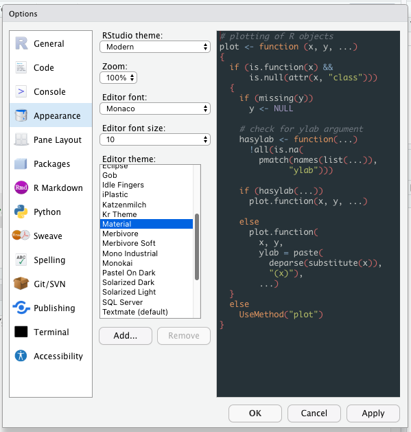

```{r setup, include=FALSE}
options(htmltools.dir.version = FALSE)
```

layout: true

<a class="footer-link" href="https://github.com/rstudio-conf-2022/intro-to-tidyverse">shortlink here</a>


???

Speaker notes go under question mark headers

---
class: title-slide

# `r rmarkdown::metadata$title`

### `r rmarkdown::metadata$subtitle`

<div class="title-footer">
  
  <div> `r rmarkdown::metadata$author` • `r rmarkdown::metadata$date`</div>
</div>

---

class: middle

# Agenda slide • title

1. Chapter title
1. Chapter title
1. Chapter title
1. Chapter title


---
class: middle chapter-slide red

.big-white-number[1.]

# Set up the IDE


---
class: middle chapter-slide red

## Workspace settings

```{r, echo=FALSE}
knitr::include_graphics("images/best_practices/rstudio-tools-global_options-genearl-basic.png")
```

---
class: middle chapter-slide red

## Customize your look

```{r, echo=FALSE}

```

---
class: middle chapter-slide blue

.big-white-number[2.]

# R Projects

---
class: middle chapter-slide blue

## Why

- Helps you isolate your thoughts (context switching)
- Explicitly sets your working directory
- Projects -- self contained

---
class: middle chapter-slide blue

## How

- File > New Project
- Use an existing folder, or start one from scratch

---
class: middle chapter-slide blue

## Relative and Absolute paths

- examples of relative + absolute paths
- Maybe show the `here` package/function?

---
class: middle chapter-slide blue

## Demo

- Create project
- write data to data folder
- save script to root folder
- move script to sub folder (e.g., `analysis`)
- code still runs

- Image: rstudio > session > set working directory > to project directory
- With a project you have a consistent way to set/change your working directory
    - not tied to your specific working environment

---
class: middle chapter-slide green

.big-white-number[3.]

# Naming Things

---
class: middle chapter-slide green

## Examples

https://speakerdeck.com/jennybc/how-to-name-files

---
class: middle chapter-slide green

## General rules

- Machine readable
- Human readable
- Sorts/orders nicely

---
class: middle chapter-slide green

## Embrace the Slug


---
class: middle chapter-slide green

## ISO 8601

---
class: middle chapter-slide tan

.big-white-number[4.]

# Debuging + Testing

---
class: middle chapter-slide tan

## Visually check your work

---
class: middle chapter-slide tan

## Write a test for it

- you can use `stopifnot()` to have the code "check" your work

---
class: middle chapter-slide tan

## Create a reproducible example

- https://reprex.tidyverse.org/

---
class: middle chapter-slide tan

## Ways to mock up data

- built-in datasets: `mtcars`, `iris`, `ggplot::diamonds`
- `read.csv(text = "a,b\n1,2\n3,4")`
- `sample()`
- `head()`
```
tibble::tribble(
  ~ a, ~ b,
    1,   2,
    3,   4
)
```

---
class: middle chapter-slide tan

## You can also use `dput()`

- https://reprex.tidyverse.org/

---
class: middle chapter-slide tan

## Use your `dplyr` skills

- `select()` and `filter()` your data down!

---


---
.pull-left[

```{r eval=FALSE}
.
├── directory tree example
├── _site/ #<<
├── _site.yml 
├── index.Rmd 
├── schedule.Rmd 
├── lab01.Rmd 
└── lab02.Rmd 
```
]

.pull-right[

]


---
class: your-turn

# Your Turn
Instructions for a "`Your Turn`" Exercise

```{r}
# some code
1 + 1
```

---

class: inverse

# This is an inverse slide
## And a second level header
Some text and some `inline code`

---

# A regular slide

A code block. 

```{r}
2 + 3
```

And `some inline code`.
