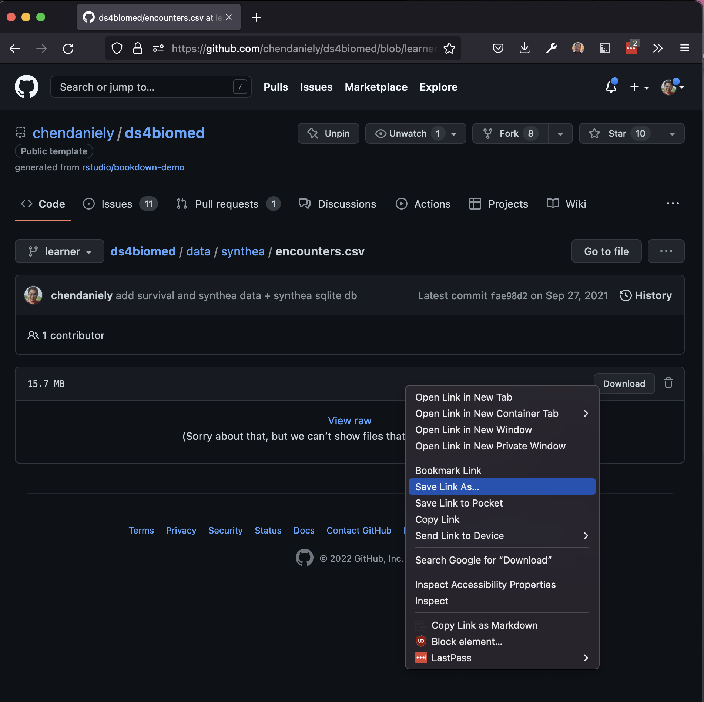
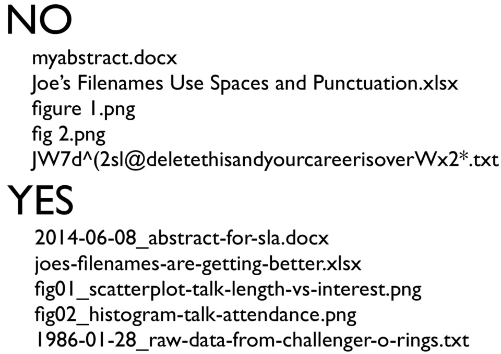

```{r setup, include=FALSE}
options(htmltools.dir.version = FALSE)
# xaringan::inf_mr() ## to auto update render

library(countdown)
```

layout: true

<a class="footer-link" href="https://github.com/rstudio-conf-2022/intro-to-tidyverse">shortlink here</a>


???

Speaker notes go under question mark headers

- so far all our work has been within website rstudio, not local
  - started from local
  - why we want you comfortable working locally
- things to take you a bit farther

---
class: title-slide

# `r rmarkdown::metadata$title`

### `r rmarkdown::metadata$subtitle`

<div class="title-footer">
  
  <div> `r rmarkdown::metadata$author` • `r rmarkdown::metadata$date`</div>
</div>

---

class: middle

# Agenda slide • title

1. Set Up the IDE
1. R Projects
1. Chapter title
1. Chapter title


---
class: middle chapter-slide red

.big-white-number[1.]

# Set up the IDE

---
class: chapter-slide red

## Workspace settings

```{r, echo=FALSE, out.width="475px", fig.align="center"}
knitr::include_graphics("images/best_practices/rstudio-tools-global_options-genearl-basic.png")
```

---

class: middle chapter-slide blue

.big-white-number[2.]

# R Projects


---
class: chapter-slide blue

<!--
TODO: move to end of section
-->

## `setwd()` and `rm(list=ls())`

<blockquote class="twitter-tweet"><p lang="en" dir="ltr">The only two things that make <a href="https://twitter.com/JennyBryan?ref_src=twsrc%5Etfw">@JennyBryan</a> 😤😠🤯. Instead use projects + here::here() <a href="https://twitter.com/hashtag/rstats?src=hash&amp;ref_src=twsrc%5Etfw">#rstats</a> <a href="https://t.co/GwxnHePL4n">pic.twitter.com/GwxnHePL4n</a></p>&mdash; Hadley Wickham (@hadleywickham) <a href="https://twitter.com/hadleywickham/status/940021008764846080?ref_src=twsrc%5Etfw">December 11, 2017</a></blockquote> <script async src="https://platform.twitter.com/widgets.js" charset="utf-8"></script> 

---
class: chapter-slide blue

## Why

TODO: add a story to build up example

1. Helps you isolate your thoughts (context switching)
2. Explicitly sets your working directory
3. Projects are self contained

---

class: chapter-slide blue

## How: File > New Project

```{r, echo=FALSE, out.width="800px", fig.align="center"}
knitr::include_graphics("images/best_practices/rstudio-new_project-01-new.png")
```

---
class: chapter-slide blue

## How: New or Existing Folder

```{r, echo=FALSE, out.width=750, fig.align="center"}
knitr::include_graphics("images/best_practices/rstudio-new_project-02-wizard.png")
```

---

class: chapter-slide blue

## How: Create

- Use your `Desktop` for now

```{r, echo=FALSE, out.width=600, fig.align="center"}
knitr::include_graphics("images/best_practices/rstudio-new_project-03-create.png")
```

---
class: your-turn

# Your Turn

TODO: go make the thing

1. make project in desktop
2. call it `conf-best_practices`

---

class: chapter-slide blue

- let's see what's in this "project" folder
- don't nest your rprojcts
- it's a regular folder with a `.rproj` file

---
class: chapter-slide blue

## Relative and Absolute paths

- Working directory: `/home/dan/git/hub/my_project/`
- Relative path: `data/original/my_data.csv`
- Absolute path: `/home/dan/git/hub/my_project/data/original/my_data.csv`

TODO: schematic of files


```
\-
|- dan
   |- Desktop
       |-
```

---
class: chapter-slide blue

## The `here` package

```{r, echo=FALSE, out.width=600, fig.align="center"}
knitr::include_graphics("images/best_practices/allison_horst-here.png")
```

---
class: middle chapter-slide blue

## Getting data for our project

- getting data from github is common
- you can load raw csvs
- you need to download data from github
- you can download directly from github (or any URL)

---
class: middle chapter-slide blue

## Download from GitHub

.pull-left[
```{r, echo=FALSE, out.width=450, fig.align="center"}

```
]

.pull-right[
```{r, echo=FALSE, out.width=450, fig.align="center"}
knitr::include_graphics("images/best_practices/github-download-2.png")
```
]

---
class: your-turn

# Your Turn

just put everytihng in the root proj dir. more explicit names of files and variables

3. Download the `encounters.csv` into data folder
  - https://bit.ly/rstudio2022-encounters
4. Create an R script somewhere anywhere
5. Load the `encounters.csv` dataset into R in anyway you know how

```{r, echo=FALSE}
countdown(minutes = 3, warn_when = 30)
```

---
class: chapter-slide blue

## How did you laod data?

1. Rstudio > session > set working directory
2. using the import GUI
2. Full path
3. Relative path
  - `encounters.csv`
  - `data/encounters.csv`
  - `../data/encounters.csv`
  - `here("data", "encounters.csv")`

---
class: chapter-slide blue

example + story of co-worker and the way they imported

ask if this will work on your computer


---
class: your-turn

# Your Turn

1. Move script to sub folder (e.g., `analysis`) and move data to `data/`
2. Check to see if your dataset loads now. (it probably doesn't)
  - see if the code chunk works
  - see if it knits
3. Fix your path to make it load
  - `../data/`
  - `/home/users/Dan/Desktop/asdfasdf/data/asdf.csv`

```{r, echo=FALSE}
countdown(minutes = 2, warn_when = 15)
```

---
class: chapter-slide blue

## The `here` package

```{r}
library(here)

here()
```

```{r}
here("data", "my_data.csv")
```

---
class: your-turn

- use `here()` instead

---

class: your-turn

create a subfolder, `load` in `analysis`: `analysis/laod/asdf.Rmd`

- Q: does your file laod the data without chanign the cata path?

---
class: middle chapter-slide green

.big-white-number[3.]

# Naming Things

---
class: chapter-slide green

## Examples

```{r, echo=FALSE, out.width=600, fig.align="center"}

```

https://speakerdeck.com/jennybc/how-to-name-files

---
class: chapter-slide green

## General rules

1. Machine readable
2. Human readable
3. Sorts/orders nicely

---
class: chapter-slide green

## Embrace the Slug

Descriptive name after a sortable term in the file name.

.pull-left[
- 01.R
- 02.R
- 03.R
]

.pull-right[
- 01-read_data.R
- 02-visualize_data.R
- 03-analyze_data.R
]


---
class: chapter-slide green

## ISO 8601 for Dates

How to write your dates and times YYYY-MM-DD

- Date: 2022-07-25
- Date and time in UTC
  - 2022-07-25T21:05:17+00:00
  - 2022-07-18T21:05:17Z
  - 20220718T210517Z
- Week: 2022-W30
  - Domains have different starting week rules
- Week with weekday: 2022-W29-1
- Date without year: --07-25[1]
- Ordinal date: 2022-206

---

class: middle chapter-slide tan

## Use your `dplyr` skills

- `select()` and `filter()` your data down!
- to build up this example

---
class: your-turn

# Your Turn


<!--
TODO: come up with a multi step exercise here
-->

1. Look for heart attack encounters
  - `description` has a value of "Cardiac Arrest" or "Myocardial Infarction"
2. Save this dataset out to a file here("data", `mi.csv`) TODO:
3. Answer the following questions in code in a separate file using the `mi.csv` file
  - How many different patients have a heart attack encounter?
  - what are the different types of `encounterclass`?

```{r, echo=FALSE}
countdown(minutes = 5, warn_when = 60)
```

---

class: middle chapter-slide green

- talk about exercise before
- best pracice is to save data in a special "output"-like folder
- name your file something so it sorts properly

---

class: middle chapter-slide green

https://style.tidyverse.org/

rules for naming variables: use `_` no captical letters, no `.`

- the same rules apply for your column names in your data

---

class: middle chapter-slide green

- ask them to do, and describe janitor::clean_names() on the `iris` dataset

---
class: middle chapter-slide red

.big-white-number[5.]

# Customizations

---

class: middle chapter-slide red

## Optional: Customize Theme

```{r, echo=FALSE}
knitr::include_graphics("images/best_practices/rstudio-tools-global_options-appearance.png")
```

---

class: chapter-slide red

## Optional: Customize Font

https://github.com/tonsky/FiraCode

- FiraCode is a popular font
    - ligatures
    - monospaced

```{r, echo=FALSE}
knitr::include_graphics("images/best_practices/firacode-logo.svg")
```


==

!=


|>

%>%


---


class: middle chapter-slide tan

.big-white-number[4.]

# Best practrices for _asking_ for help

---
class: chapter-slide tan

- jenny's talk
- pkgdown site for `reprex`


---

class: chapter-slide red

## reverse agenda slide of review of best practices

- https://github.com/chendaniely/dissertation-analysis (in finder locally)