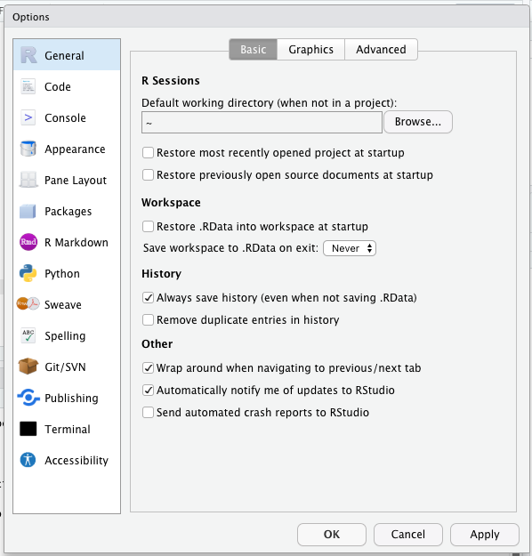
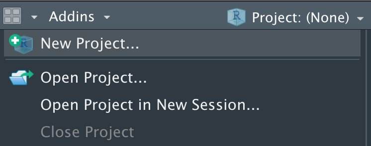
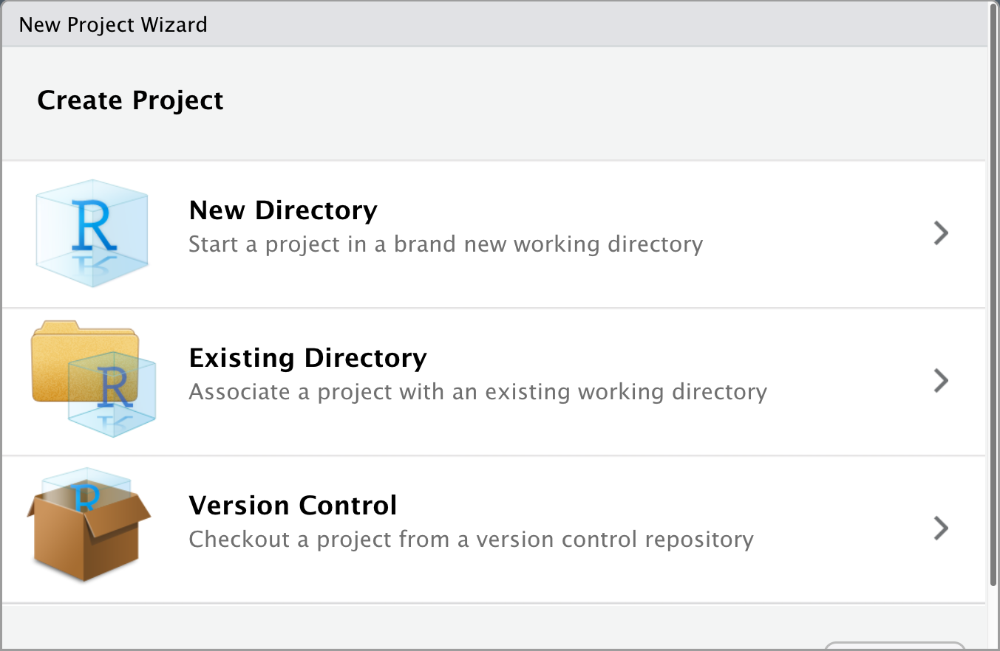
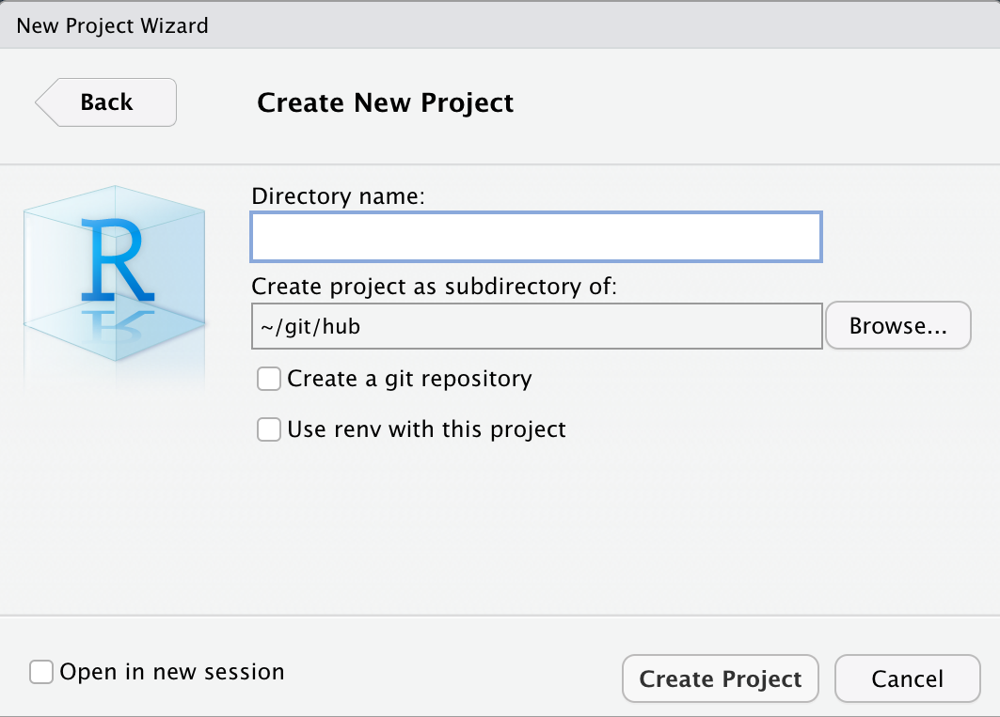
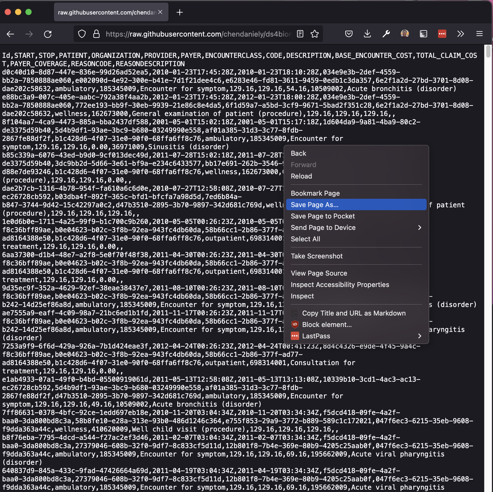

```{r setup, include=FALSE}
options(htmltools.dir.version = FALSE)
# xaringan::inf_mr() ## to auto update render

library(countdown)
```

layout: true

<a class="footer-link" href="https://github.com/rstudio-conf-2022/intro-to-tidyverse">shortlink here</a>


???

Speaker notes go under question mark headers

---
class: title-slide

# `r rmarkdown::metadata$title`

### `r rmarkdown::metadata$subtitle`

<div class="title-footer">
  
  <div> `r rmarkdown::metadata$author` • `r rmarkdown::metadata$date`</div>
</div>

---

class:

# Switching it up!

- So far, everything is within RStudio Academy
- We also want you to be comfortable working on your own machines
- Things to take you a bit farther

---

class: middle

# Best Practices in...

1. Set Up the IDE
1. R Projects
1. Chapter title
1. Chapter title


---
class: middle chapter-slide red

.big-white-number[1.]

# Set up the IDE

---
class: chapter-slide red

## Workspace settings

```{r, echo=FALSE, out.width="475px", fig.align="center"}

```

```{r, echo=FALSE}
countdown(minutes = 2, warn_when = 30)
```

---

class: middle chapter-slide blue

.big-white-number[2.]

# R Projects

---
class: chapter-slide blue

.pull-left[
## It works on my machine

1. You work on something
2. You want to share it with your collegues
3. They can't run any of your code
]
.pull-right[
```{r, echo=FALSE}
knitr::include_graphics("https://imgs.xkcd.com/comics/borrow_your_laptop.png")
```

]

---
class: chapter-slide blue

## How do RProjects help?

1. Helps you isolate your thoughts (context switching)
2. Explicitly sets your working directory
  - Helps you point to your files
3. Projects are self contained

---

class: chapter-slide blue

## How: File > New Project

```{r, echo=FALSE, out.width="800px", fig.align="center"}

```

---
class: chapter-slide blue

## How: New or Existing Folder

```{r, echo=FALSE, out.width=750, fig.align="center"}

```

---

class: chapter-slide blue

## How: Create

- Use your `Desktop` for now

```{r, echo=FALSE, out.width=600, fig.align="center"}

```

---
class: your-turn

# Your Turn

1. Create a new RStudio project
1. Put the project on your `Desktop`
2. Name your project: `conf-best_practices`

```{r, echo=FALSE}
countdown(minutes = 2, warn_when = 30)
```

---

class: chapter-slide blue

## Project DO's and Don'ts

.pull-left[
### DO

- Use projects as often as you can
- Create a `temp` project to throw all your `test` and `Untitled.Rmd` files into
- Consolidate all your projects into a single big project
]
.pull-right[
### DON'T
- Nest your R PRrojects
  - You will confuse your working directories
]

---

class: chapter-slide blue

.pull-left[

## What's in a Project?

- A regular folder with a `.Rproj` file:

```
.
..
├── README.md
└── conf-best_practices.Rproj
```
]
.pull-right[


```
Version: 1.0

RestoreWorkspace: Default
SaveWorkspace: Default
AlwaysSaveHistory: Default

EnableCodeIndexing: Yes
UseSpacesForTab: Yes
NumSpacesForTab: 2
Encoding: UTF-8

RnwWeave: Sweave
LaTeX: pdfLaTeX

BuildType: Custom
CustomScriptPath: .build-site.R
```
]


---
class: chapter-slide blue

## Getting data for our project

- `read_csv()` from `{readr}` and `{tidyverse}`
  - You can load raw csvs
  - You can load directly from github (or any URL)

- You can download data from github
  - Getting data from github is common

---
class: chapter-slide blue

## Download from GitHub

.pull-left[
```{r, echo=FALSE, out.width=450, fig.align="center"}
knitr::include_graphics("images/best_practices/github-download-1.png")
```
]

.pull-right[
```{r, echo=FALSE, out.width=450, fig.align="center"}

```
]

---

class: your-turn

# Your Turn

In your `conf-best_practices` folder:

1. Save/Download the `encounters.csv`
  - https://bit.ly/rstudio2022-encounters
2. Create an R script in your `conf-best_practices` folder
3. Load the `encounters.csv` dataset into R, save it as the `encounters` variable

```{r, echo=FALSE}
countdown(minutes = 3, warn_when = 30)
```

---
class: chapter-slide blue

## Relative and Absolute paths

.pull-left[
```
/
 |- Users/
  |- Daniel/
   |- Desktop/
    |- best_practices/
     |- data/
     | |- cool_stuff.csv
     |
     |- 01-load_data.R
     |- README.md
     |- best_practices.Rproj
```
]
.pull-right[
```
C:\
 |- Users\
  |- Daniel\
   |- Desktop\
    |- best_practices\
     |- data\
     | |- cool_stuff.csv
     |
     |- 01-load_data.R
     |- README.md
     |- best_practices.Rproj
```
]

- Working directory: `/Users/Daniel/Desktop/best_practices/`
- Relative path: `data/cool_stuff.csv`
- Absolute path: `//Users/Daniel/Desktop/best_practices/data/cool_stuff.csv`

---
class: your-turn

# Your Turn

1. Create a `data` folder and move the `encounters.csv` file into it.
2. Load the `encounters.csv` dataset into R, save it as the `encounters` variable

```{r, echo=FALSE}
countdown(minutes = 3, warn_when = 30)
```


---
class: chapter-slide blue

## How did you laod data?

1. Rstudio > session > set working directory
2. using the import GUI
2. Full path
  - `/Users/Daniel/Desktop/best_practices/data/encounters.csv`
3. Relative path
  - `encounters.csv`
  - `data/encounters.csv`
  - `../data/encounters.csv`

?

Ask which of these would work on their own computer

---
class: your-turn

# Your Turn

1. Move the script into an `analysis` folder
2. Check to see if your dataset loads now.
  - see if the code chunk works
  - see if it knits
3. Fix the path to make the data load


```{r, echo=FALSE}
countdown(minutes = 2, warn_when = 15)
```

---
class: chapter-slide blue

.pull-left[
## The `here` package
]
.pull-right[
```{r, echo=FALSE, out.width=750, fig.align="center"}
knitr::include_graphics("images/best_practices/allison_horst-here.png")
```
]

---
class: chapter-slide blue

## The `here` package

```{r}
library(here)

here()
```

```{r}
here("data", "my_data.csv")
```

---
class: your-turn

# Your Turn

1. Use `here()` to load up your data
2. create a subfolder, `load` in `analysis`: `analysis/laod/load_data.Rmd`
  - Does your file still load, even after you move your script to a different location?

```{r, echo=FALSE}
countdown(minutes = 3, warn_when = 15)
```

---
class: chapter-slide blue

## `setwd()` and `rm(list=ls())`

<blockquote class="twitter-tweet"><p lang="en" dir="ltr">The only two things that make <a href="https://twitter.com/JennyBryan?ref_src=twsrc%5Etfw">@JennyBryan</a> 😤😠🤯. Instead use projects + here::here() <a href="https://twitter.com/hashtag/rstats?src=hash&amp;ref_src=twsrc%5Etfw">#rstats</a> <a href="https://t.co/GwxnHePL4n">pic.twitter.com/GwxnHePL4n</a></p>&mdash; Hadley Wickham (@hadleywickham) <a href="https://twitter.com/hadleywickham/status/940021008764846080?ref_src=twsrc%5Etfw">December 11, 2017</a></blockquote> <script async src="https://platform.twitter.com/widgets.js" charset="utf-8"></script> 


---
class: middle chapter-slide green

.big-white-number[3.]

# Naming Things

---
class: chapter-slide green

## Examples

```{r, echo=FALSE, out.width=600, fig.align="center"}
knitr::include_graphics("images/best_practices/naming-example.png")
```

- https://speakerdeck.com/jennybc/how-to-name-files

---
class: chapter-slide green

## General rules

1. Machine readable
2. Human readable
3. Sorts/orders nicely

---
class: chapter-slide green

## Embrace the Slug

Descriptive name after a sortable term in the file name.

.pull-left[
- 01.R
- 02.R
- 03.R
]

.pull-right[
- 01-read_data.R
- 02-visualize_data.R
- 03-analyze_data.R
]


---
class: chapter-slide green

## ISO 8601 for Dates

How to write your dates and times YYYY-MM-DD

- Date: 2022-07-25
- Date and time in UTC
  - 2022-07-25T21:05:17+00:00
  - 2022-07-18T21:05:17Z
  - 20220718T210517Z
- Week: 2022-W30
  - Domains have different starting week rules
- Week with weekday: 2022-W29-1
- Date without year: --07-25[1]
- Ordinal date: 2022-206
---
class: your-turn

# Your Turn

- Use your `dplyr` skills
- `select()` and `filter()` your data down!

<!--
TODO: come up with a multi step exercise here
-->

1. Look for heart attack encounters
  - `description` has a value of "Cardiac Arrest" or "Myocardial Infarction"
2. Save this dataset out to a file `here("data", "mi.csv")`
- Answer the following questions in code in a separate file using the `mi.csv` file
  - How many different patients have a heart attack encounter?
  - what are the different types of `encounterclass`?

```{r, echo=FALSE}
countdown(minutes = 5, warn_when = 60, top=0) # top right timer
```

---
class: chapter-slide green

## How to improve?

- Save data in a special "output"-like folder
- Name your file something so it sorts properly

---
class: chapter-slide green

## Code style

See: https://style.tidyverse.org/

1. Variable names: use `_`: no captical letters, no `.`
2. Same rules apply for your column names in your data

---
class: your-turn

# Your Turn

A quick way to fix your column names

1. Load the `{janitor}` package
2. Look at the `iris` dataset
3. Use the `clean_names()` function on the the `iris` dataset

---
class: middle chapter-slide red

.big-white-number[5.]

# Customizations

---

class: chapter-slide red

## Optional: Customize Theme

```{r, echo=FALSE, out.width=500, fig.align="center"}
knitr::include_graphics("images/best_practices/rstudio-tools-global_options-appearance.png")
```

---

class: chapter-slide red

## Optional: Customize Font

https://github.com/tonsky/FiraCode

- FiraCode is a popular font
    - ligatures (e.g., `!=`, `==`, `|>`)
    - monospaced

```{r, echo=FALSE}
knitr::include_graphics("images/best_practices/firacode-logo.svg")
```

---

class: middle chapter-slide tan

.big-white-number[4.]

# Best practrices for _asking_ for help

---
class: chapter-slide tan

- Jenny Bryan | Object of type ‘closure’ is not subsettable | RStudio (2020)
  - https://www.youtube.com/watch?v=vgYS-F8opgE
- `{reprex}` package for REPRoducible EXamples
  - https://reprex.tidyverse.org/

---

class: chapter-slide inverse

## Best Practices

1. Use an R PRoject
2. Use relative paths to refer to files
3. Name your files: human+machine readable, sortable
4. Use folders to separate work
5. Reproducibility is the key to sharing and asking for help

- Example project with some of these features: https://github.com/chendaniely/dissertation-analysis
