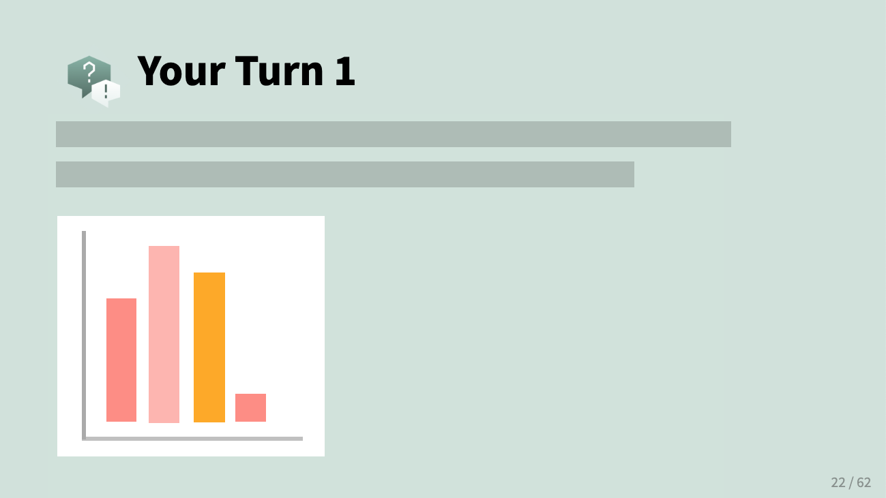

class:

```{r setup, include=FALSE}
options(htmltools.dir.version = FALSE)
knitr::opts_chunk$set(fig.retina = 3)
library(tidyverse)
```

```{r reactable-function, include=FALSE}
reactable_preview <- function(data) {
  
  page_info <- "{rowStart}-{rowEnd} of {rows} rows"
  
  if (nrow(data) > 100) {
    page_info <- glue::glue(
      "{page_info} (Total: {actual})", 
      actual = format(nrow(data), big.mark = ",")
    )
  }
  
  data %>% 
    slice_head(n = 100) %>% 
    reactable::reactable(
      defaultColDef = reactable::colDef(align = "left", maxWidth = 400),
      defaultPageSize = 8, 
      compact = TRUE,
      wrap = FALSE,
      striped = TRUE,
      sortable = FALSE, 
      showPageInfo = TRUE,
      language = reactable::reactableLang(
        pageInfo = page_info
      )
    )
}
```

```{r xaringan-stuff, include=FALSE}
xaringanExtra::use_xaringan_extra(c("tile_view", "panelset", "share_again"))
xaringanExtra::use_clipboard(selector = "pre > code.r, pre > code.md")
xaringanExtra::use_tachyons()

if (!is.null(rmarkdown::metadata$shortlink)) {
  shortlink <- rmarkdown::metadata$shortlink
  if (is.character(shortlink)) {
    shortlink <- list(url = shortlink)
  }
  stopifnot(!is.null(shortlink$url))
  
  if (is.null(shortlink$text) || !nzchar(shortlink$text)) {
    shortlink$text <- basename(shortlink$url)
  }
  
  xaringanExtra::use_banner(
    bottom_left = htmltools::tags$a(href = shortlink$url, shortlink$text),
    exclude = "title-slide"
  )
}
```


# .big-text[Welcome] 

## Introduction to the tidyverse 

Find your group's table and make yourself comfortable. 

We'll get started shortly after 9am.


<div class="title-footer">
  
  <div> </div>
</div>

---
class: middle, agenda

# Session 1 Agenda

1. Logistics: Policies, Goals, and Schedules
1. Tech and tooling
1. Review: Group challenge


---
class: middle chapter-slide blue

.big-white-number[1.]

# Policies, Goals, & Schedules 

---

class: inverse, middle

# Conference workshop policies

.left-column[

  .center[

  `r emo::ji("door")` `r emo::ji("dash")` 

  <br>

  `r emo::ji("no_entry_sign")` `r emo::ji("camera")` 
  
  <br>

  
  `r emo::ji("face_with_medical_mask")` `r emo::ji("microbe")`
  ]
]

.right-column[

  Identify the exits closest to you in case of emergency 

  <br>

  Please do not photograph people wearing .light-red[red lanyards] 
  
  <br>
   
  Fully cover your mouth and nose at all times. A limited supply of masks are available upon request. Ask at registration desk.
   
] 

---

# Code of conduct

- Please review the [rstudio::conf code of conduct](https://rstd.io/code-of-conduct) that applies to all workshops <https://rstd.io/code-of-conduct>

--

- CoC issues can be addressed three ways:

  - In person: contact any rstudio::conf staff member or the conference registration desk  
  
  - By email: send a message to `conf@rstudio.com`  
  
  - By phone: call 844-448-1212  

---
class: inverse, middle

# Locations to note

.left-column[

  .center[

  `r emo::ji("men_s_room")` `r emo::ji("water_closet")`
  
  <br>

  `r emo::ji("person_in_lotus_position")` `r emo::ji("tent")`
  
  <br>
  <br>
  
  `r emo::ji("nursing")` `r emo::ji("baby_bottle")`
  ]
]

.right-column[

  Gender neutral bathrooms are near National Harbor rooms

  <br>


  A meditation / chill-out room is open 8am - 5pm, Mon - Thurs in **National Harbor 9** if you want quiet space to recharge.
  
   <br>
   
  A lactation room is located at **Potomac Dressing Room**. Open 8am - 5pm, Mon - Thurs.
   
] 
  
---
class: middle, center, inverse

.pull-left[
# `r fontawesome::fa("fas fa-wifi")`
Wifi network name  

.light-red[`r params$wifi_network`]

]

.pull-right[
# `r fontawesome::fa("fas fa-key")`

Wifi password

.light-red[`r params$wifi_password`]

]

---
class: inverse, center, middle
background-image: url("https://images.unsplash.com/photo-1538370965046-79c0d6907d47?ixlib=rb-1.2.1&ixid=MnwxMjA3fDB8MHxwaG90by1wYWdlfHx8fGVufDB8fHx8&auto=format&fit=crop&w=2938&q=80")
background-size: cover


--

# The `tidyverse`

---
background-image: url("https://images.unsplash.com/photo-1457369804613-52c61a468e7d?ixlib=rb-1.2.1&ixid=MnwxMjA3fDB8MHxwaG90by1wYWdlfHx8fGVufDB8fHx8&auto=format&fit=crop&w=1770&q=80")
background-size: cover


---
background-image: url("https://images.unsplash.com/photo-1614935151651-0bea6508db6b?ixlib=rb-1.2.1&ixid=MnwxMjA3fDB8MHxwaG90by1wYWdlfHx8fGVufDB8fHx8&auto=format&fit=crop&w=1850&q=80")
background-size: cover


---
background-image: url("https://images.unsplash.com/photo-1584208124835-8a3d74ae211c?ixlib=rb-1.2.1&ixid=MnwxMjA3fDB8MHxwaG90by1wYWdlfHx8fGVufDB8fHx8&auto=format&fit=crop&w=1084&q=80")
background-size: cover


---
background-image: url("https://images.unsplash.com/photo-1517245386807-bb43f82c33c4?ixlib=rb-1.2.1&ixid=MnwxMjA3fDB8MHxwaG90by1wYWdlfHx8fGVufDB8fHx8&auto=format&fit=crop&w=1770&q=80")
background-size: cover


---

background-image: url("https://images.unsplash.com/photo-1562411052-105105232432?ixlib=rb-1.2.1&ixid=MnwxMjA3fDB8MHxwaG90by1wYWdlfHx8fGVufDB8fHx8&auto=format&fit=crop&w=1771&q=80")
background-size: cover


---
background-image: url("https://images.unsplash.com/photo-1519389950473-47ba0277781c?ixlib=rb-1.2.1&ixid=MnwxMjA3fDB8MHxwaG90by1wYWdlfHx8fGVufDB8fHx8&auto=format&fit=crop&w=1770&q=80")
background-size: cover


---
background-image: url("https://images.unsplash.com/photo-1500106067612-d3b2531fc762?ixlib=rb-1.2.1&ixid=MnwxMjA3fDB8MHxwaG90by1wYWdlfHx8fGVufDB8fHx8&auto=format&fit=crop&w=928&q=80")
background-size: cover


---
class: center, top
background-image: url(https://images.unsplash.com/photo-1520962880247-cfaf541c8724?ixlib=rb-1.2.1&ixid=MnwxMjA3fDB8MHxwaG90by1wYWdlfHx8fGVufDB8fHx8&auto=format&fit=crop&w=1332&q=80)
background-position: center
background-size: cover

# Goals


--

Drill old wrangling skills and explore new ones

--

Learn best practices for exploring your data and reporting it reproducibly 

---
class: center, middle, chapter-slide red

.big-text.white.center[Hello!]


---
class: speaker-slide

# `r rmarkdown::metadata$author`

<!-- You can copy the image link address from your github profile to use as the src link below --> 


.speaker-links[
[`r fontawesome::fa("github")` dcossyleon](https://github.com/dcossyleon)    
[`r fontawesome::fa("twitter")` dcossyle](https://twitter.com/dcossyle)   
[`r fontawesome::fa("link")` desiree.rbind.io](https://desiree.rbind.io)
]


---
class: center

# Meet the team

<div class="cf-ns nl2 nr2">
  <div class="fl-ns w-20-ns pv4">
    <div class="tc">
      
    </div>
    <div class="f6 fw6 gray ttu tracked mt2">
      Kristin Bott
    </div>
  </div>


  <div class="fl-ns w-20-ns pv4">
    <div class="tc">
      
    </div>
    <div class="f6 fw6 gray ttu tracked mt2">
      Brendan Cullen
    </div>
  </div>
  
  
  <div class="fl-ns w-20-ns pv4">
    <div class="tc">
      
    </div>
    <div class="f6 fw6 gray ttu tracked mt2">
      Daniel Chen
    </div>
  </div>
  
  
  <div class="fl-ns w-20-ns pv4">
    <div class="tc">
      
    </div>
    <div class="f6 fw6 gray ttu tracked mt2">
      Sara Altman
    </div>
  </div>
  
  <div class="fl-ns w-20-ns pv4">
    <div class="tc">
      
    </div>
    <div class="f6 fw6 gray ttu tracked mt2">
      Deirdre Francks
    </div>
  </div>
  
  <div class="fl-ns w-20-ns pv4">
    <div class="tc">
      
    </div>
    <div class="f6 fw6 gray ttu tracked mt2">
Steven Smallberg    </div>
  </div>
  
  
  <div class="fl-ns w-20-ns pv4">
    <div class="tc">
      
    </div>
    <div class="f6 fw6 gray ttu tracked mt2">
Laura Puckett    </div>
  </div>
  
  
  <div class="fl-ns w-20-ns pv4">
    <div class="tc">
      
    </div>
    <div class="f6 fw6 gray ttu tracked mt2">
      Garrett Grolemund    
    </div>
  </div>
  
  
  <div class="fl-ns w-20-ns pv4">
    <div class="tc">
      
    </div>
    <div class="f6 fw6 gray ttu tracked mt2">
      Dan Buch
    </div>
  </div>
  
  <div class="fl-ns w-20-ns pv4">
    <div class="tc">
      
    </div>
    <div class="f6 fw6 gray ttu tracked mt2">
      Garrick Aden-Buie
    </div>
  </div>
  
  
  
</div>


---
class: middle, center
background-image: url("images/session01/scooters.jpg")
background-size: cover


---
class: middle, center
background-image: url("images/session01/scooters-dark.png")
background-size: cover

# .big-text.white[The Lineup]


---
class: middle, center 

.pull-left[

# Day One:

### Review + Best Practices 

]


--

.pull-right[

# Day Two:

### Transformation + Milestone  

]


---
class: middle, center

.pull-left[

# Day One:

### Review + Best Practices

Review

Exploratory data analysis

R Markdown for reproducible results

R Projects and your local IDE
]

.pull-right[
# Day Two:

### Transformation + Milestone  

]


--

.pull-right[

Summarize data and work with groups

Recoding variables + Milestone recreation

Lightning talks + Milestone extension

Milestone presentation
]

---
class: center


.left-column1[

# Schedule

.spaced[

| Time          | Activity                                                      |
|:--------------|:--------------------------------------------------------------|
| 09:00 - 10:30 | Session 1                                                     |
| 10:30 - 11:00 | *Break* `r emo::ji("coffee")`                                 |
| 11:00 - 12:30 | Session 2                                                     |
| 12:30 - 01:30 | *Lunch* `r emo::ji("bento")`                                  |  
| 01:30 - 03:00 | Session 3                                                     |
| 03:00 - 03:30 | *Break* `r emo::ji("tea")`                                    |
| 03:30 - 05:00 | Session 4                                                     |

]
]


--

.right-column63[
# Workspace

]


---
class: chapter-slide, tan, middle

.big-white-number[2.]

# Tech and tooling


---
class: inverse, middle, center
.pull-left[
  ### Presenting

]


---
class: inverse, middle, center

.pull-left[
  
  ### Presenting

  ```{r zoom, echo = FALSE, out.width = "25%"}
  knitr::include_graphics("images/session01/zoom.png")
  ```

]


---
class: inverse, middle, center

.pull-left[
  
  ### Presenting

  ```{r ref.label = "zoom", echo = FALSE, out.width = "25%"}
  ```

  Muted 
  
  No camera  
  
  Your group session link  

]


--

.pull-right[
  ### Code + Announcements

  <br>
    
  ```{r slack, echo = FALSE, out.width = "40%"}
  knitr::include_graphics("images/session01/slack.png")
  ```

  <br>
  
  Your group's slack channel  
  
  `#intro-to-tidyverse`
  
]

---
class: inverse, center, middle

.pull-left[

## Done! 

```{r g, echo = FALSE}
knitr::include_graphics("images/session01/green-square.png")
```
]


--

.pull-right[

## Help! 

```{r p, echo = FALSE}

```
]


---
class: middle, chapter-slide green

.big-white-number[3.]

# Review: Group challenge


---
class: inverse

.big-text.white[
# Questions?
]


---
class: title-slide

# `r rmarkdown::metadata$title`

### `r rmarkdown::metadata$subtitle`

<div class="title-footer">
  
  <div> `r rmarkdown::metadata$author` • `r rmarkdown::metadata$date`</div>
</div>


---
class: inverse

### Go to **Conf Session 1 - Review**

.center[
```{r session1-workspace, echo = FALSE, out.width = "80%", fig.align = "center"}

```
]


---

## `r emo::ji("rocket")` Rapid fire review 


```{r label, echo = FALSE}

```


---

# Review challenge rules

* For each prompt, the __first group with 4 or more people to have the answer correct__ (as verified by your mentor), scores a point.

--

* You must have the __correct code__ *and* the __correct output__.

--

* __Working together__ with your groupmates is encouraged.

--

* After 1-2 minutes, we'll go over the answer together. And then move on to the next question. 

--

* Group with the most points at the end wins (a small prize!)


---
class: inverse, center, middle

.pull-left[

## Done! 

```{r, echo = FALSE}
knitr::include_graphics("images/session01/green-square.png")
```
]

.pull-right[

## Help! 

```{r, echo = FALSE}

```
]


---
class: center, middle


# .big-text[Questions?]


---
class: center, middle
background-image: url(https://images.unsplash.com/photo-1579780864813-863e246d3bc5?ixlib=rb-1.2.1&ixid=MnwxMjA3fDB8MHxwaG90by1wYWdlfHx8fGVufDB8fHx8&auto=format&fit=crop&w=1160&q=80)
background-position: center
background-size: cover


---
class: center, middle, inverse
background-image: url(https://images.unsplash.com/photo-1579780864813-863e246d3bc5?ixlib=rb-1.2.1&ixid=MnwxMjA3fDB8MHxwaG90by1wYWdlfHx8fGVufDB8fHx8&auto=format&fit=crop&w=1160&q=80)
background-position: center
background-size: cover

```{r load-data, include=FALSE}
library(tidyverse)

readxl::read_excel("data/session01/NationalOutbreakPublicDataTool.xlsx", sheet = 1) %>%
  janitor::clean_names() %>%
  readr::write_csv("data/session01/outbreaks.csv")
```

# .big-text[`outbreaks`]


---
class: your-turn

# Your Turn 1

Read in the data and explore it. Can you recreate output that looks like this?

```{r read-in-outbreaks, include = FALSE}
outbreaks <- readr::read_csv("data/session01/outbreaks.csv")
```

.space-saver[
```{r echo = FALSE}
glimpse(outbreaks)
#str(outbreaks)
```
]


---

## Solution 1
.pull-left[
```{r sol-1, eval = FALSE}
library(tidyverse)

outbreaks <- 
  read_csv("data/outbreaks.csv")

glimpse(outbreaks)
```
]

.pull-right.space-saver[
```{r echo = FALSE, message = FALSE}
glimpse(outbreaks)
```
]

---
class: your-turn

# Your Turn 2

What is the* **earliest year** on record in this dataset? __The latest__? 

Answer the questions by creating two tables that are sorted.

---

## Solution 2

.pull-left[
```{r eval = FALSE, echo = TRUE}
outbreaks %>%
  arrange(year)
```

.space-saver[
```{r echo = FALSE}
outbreaks %>%
  arrange(year) %>% 
  reactable_preview()
```
]
]

.pull-right[
```{r eval = FALSE}
outbreaks %>%
  arrange(desc(year))
```

.space-saver[
```{r echo = FALSE}
outbreaks %>%
  arrange(desc(year)) %>% 
  reactable_preview()
```
]
]

---
class: your-turn

# Your Turn 3

The `state` variable appears to include US locations -- is the data limited to the 50 states? 

Produce a table that displays all the unique values of this variable.


---

## Solution 3

```{r sol-3, echo = TRUE, eval = FALSE}
outbreaks %>%
  distinct(state)
```

```{r, echo = FALSE, eval = TRUE}
outbreaks %>%
  distinct(state) %>% 
  reactable_preview()
```

---
class: your-turn

# Your Turn 4

What are the different etiologies that have been recorded in this dataset, and how often do they appear in the data? Display your results in a table like the one below.

```{r echo = FALSE}
outbreaks %>%
  count(etiology) %>% 
  reactable_preview()
```

---

## Solution 4

```{r eval = FALSE}
outbreaks %>%
  count(etiology)
```

```{r echo = FALSE}
outbreaks %>%
  count(etiology) %>% 
  reactable_preview()
```


---
class: your-turn

# Your Turn 5

Let's turn our attention to only observations where the primary mode of infection is Food. Using that criterion, can you reproduce the table below?

```{r echo = FALSE}
outbreaks %>%
  filter(primary_mode == "Food") %>% 
  count(ifsac_category) %>% 
  reactable_preview()
```

???

---

## Solution 5

```{r echo = TRUE, eval = FALSE}
outbreaks %>%
  filter(primary_mode == "Food") %>% 
  count(ifsac_category)
```

```{r echo = FALSE}
outbreaks %>%
  filter(primary_mode == "Food") %>% 
  count(ifsac_category) %>% 
  reactable_preview()
```


---
class: your-turn

# Your Turn 6

.pull-left[
Explore the relationship between `month` and the number of illnesses with a series of **boxplots** like the one to the right. Can you recreate it? 
]

.pull-right[
```{r sol-6, echo = FALSE}
outbreaks %>% 
  ggplot(aes(x = month, y = illnesses)) + 
  geom_boxplot(aes(group = month)) #<<
```
]


---

## Solution 6

.wide-left[
```{r ref.label = "sol-6", fig.show = "hide"}
```
]

.narrow-right[
```{r ref.label = "sol-6", echo = FALSE}
```
]

???

But outlier here makes it hard to see what's going on. Let's modify this.

---
class: your-turn

# Your Turn 7

Which observation in `outbreaks` is the outlier associated with such a high number of illnesses? 

  * Display solely this observation in a table. 

  * Then, recreate the boxplots **without** this observation.

---
class: space-saver

## Solution 7

.pull-left[

```{r eval = FALSE}
outbreaks %>%
  filter(illnesses == max(illnesses))
```

]

.pull-right[
```{r echo = FALSE}
outbreaks %>%
  filter(illnesses == max(illnesses)) %>% 
  reactable_preview()
```

<br>

]

--

.pull-left[
```{r sol-7-fig, fig.asp = 1/2, fig.show = "hide"}
outbreaks %>%
  filter(illnesses != max(illnesses)) %>% #<<
  ggplot(aes(x = month, y = illnesses)) + 
  geom_boxplot(aes(group = month))
```
]

.pull-right[
```{r ref.label= "sol-7-fig", echo = FALSE, fig.asp = 3/5}

```

]

---
class: your-turn

# Your Turn 8

Which outbreaks lead to the highest number of illnesses? Display these observations in a table from greatest to fewest illnesses.

---
class: space-saver

## Solution 8

```{r eval = FALSE}
outbreaks %>% arrange(desc(illnesses))
```

```{r echo = FALSE}
outbreaks %>% arrange(desc(illnesses)) %>% 
  reactable_preview()
```


---
class: your-turn

# Your Turn 9

How many different primary modes of illness are in this dataset? How often does each appear in the data?

Order the rows so that the most common primary mode appears at the top. 

---

## Solution 9

```{r eval = FALSE}
outbreaks %>%
  count(primary_mode) %>% 
  arrange(desc(n))
```

```{r echo = FALSE}
outbreaks %>%
  count(primary_mode) %>% 
  arrange(desc(n)) %>% 
  reactable_preview()
```

???

Looks like the most common primary moe for outbreaks in this particular dataset is person-to-person.

---
class: your-turn

# Your Turn 10

.pull-left[Can you figure out how to recreate this visualization of the **primary modes** of infection?]

.pull-right[
```{r echo = FALSE}
outbreaks %>%
  ggplot(mapping = aes(x = primary_mode)) + 
  geom_bar() +
  coord_flip() 
```
]

???

---

## Solution 10

.pull-left[
```{r sol-10, eval = FALSE}
outbreaks %>%
  ggplot(aes(x = primary_mode)) + 
  geom_bar() +
  coord_flip() #<<
```
]

.pull-right[
```{r ref.label = "sol-10", echo = FALSE}

```
]

---

## Solution 10 - alternative

.wide-left[
```{r sol-10-alt, eval = FALSE}
outbreaks %>%
  count(primary_mode, name = "count") %>% #<<
  ggplot(aes(x = primary_mode, y = count)) + 
  geom_col() + #<<
  coord_flip()
```
]

.narrow-right[
```{r ref.label = "sol-10-alt", echo = FALSE}

```
]

???

This one, but it's a little less efficient code-wise.

---
class: your-turn

# Your Turn 11 

Let's take a closer look at outbreaks associated with **Animal Contact**. 

* Which *individual* states have had the most Animal Contact outbreaks -- how many has each state had? 

* Create a table to answer these questions.  


---

## Solution 11

One possible solution:

```{r eval = FALSE}
outbreaks %>%
  filter(primary_mode == "Animal Contact") %>% 
  count(state) %>% 
  filter(state != "Multistate") %>%  #<<
  arrange(desc(n))
```

```{r echo = FALSE}
outbreaks %>%
  filter(primary_mode == "Animal Contact") %>% 
  count(state) %>% 
  filter(state != "Multistate") %>% 
  arrange(desc(n)) %>% 
  reactable_preview()
```

---
class: your-turn

# Your Turn 12

.left-column35[
Now that we know the top 3 states are **Ohio**, **Minnesota**, and **Idaho**, recreate this table:

* Has only the Animal Contact outbreaks for those locations  

* Column names with "animal" appear after `state`

* Drop the `primary_mode` column
]

.right-column63.space-saver[
```{r sol-12, echo = FALSE}
outbreaks %>%
  filter(
    primary_mode == "Animal Contact", 
    state %in% c("Ohio", "Minnesota", "Idaho")
  ) %>% 
  relocate(
    contains("animal"), 
    .after = state
  ) %>% 
  select(-primary_mode) %>% 
  reactable_preview()
```
]

---
class: space-saver

## Solution 12

```{r eval = FALSE}
outbreaks %>%
  filter(
    primary_mode == "Animal Contact", 
    state %in% c("Ohio", "Minnesota", "Idaho")
  ) %>% 
  relocate(
    contains("animal"), 
    .after = state
  ) %>% 
  select(-primary_mode)
```

```{r ref.label = "sol-12", echo = FALSE}

```

---
class: your-turn

# Your Turn 13

.pull-left[Excluding the outlier we previously identified, visualize the relationship between **year** and number of **illnesses** with a smooth line plot.   

Color each line by its primary mode.]

.pull-right[

```{r echo = FALSE, message = FALSE}
outbreaks %>%
  filter(illnesses != max(illnesses)) %>% 
  ggplot(aes(y = illnesses, x = year, color = primary_mode)) + 
  geom_smooth(se = FALSE)
```
]

---

## Solution 13

.pull-left[
```{r sol-13, eval = FALSE, message = FALSE}
outbreaks %>%
  filter(illnesses != max(illnesses)) %>% 
  ggplot(aes(y = illnesses, x = year, color = primary_mode)) + 
  geom_smooth(se = FALSE)
```
]

.pull-right[
```{r ref.label = "sol-13", echo = FALSE, message = FALSE}
```
]


---
class: your-turn

# Your Turn 14

Visualize the number of illnesses in **Washington DC**, grouped by **primary mode** of infection. *Hint: you may need to investigate violin plot*

```{r sol-14, echo = FALSE, fig.height = 4.5, fig.width = 11, out.width = "80%"}
outbreaks %>% 
  filter(state == "Washington DC") %>%
  ggplot(aes(x = primary_mode, y = illnesses)) +
  geom_violin(aes(color = primary_mode)) + 
  geom_point(alpha = 0.3) # any alpha value < 1 is OK
```

---

## Solution 14


```{r ref.label = "sol-14", fig.show = "hide", message = FALSE, warning = FALSE}
```


```{r ref.label = "sol-14", echo = FALSE, message = FALSE, fig.height = 4.5, fig.width = 11, out.width = "75%", warning = FALSE}
```

---
class: your-turn

# Your Turn 15

Let's focus only on **Washington DC** and **food borne illnesses**. Show the most recent outbreaks in a table from most recent to least recent.

---

## Solution 15 

.left-column40[
```{r eval = FALSE}
outbreaks %>% 
  filter(
    state == "Washington DC" & 
    primary_mode == "Food"
  ) %>%
  arrange(desc(year), desc(month))
```
]

.right-column55[
```{r echo = FALSE}
outbreaks %>% 
  filter(
    state == "Washington DC" & 
    primary_mode == "Food"
    ) %>%
  arrange(desc(year), desc(month)) %>% 
  reactable_preview()
```
]

---
class: your-turn

# Your Turn 16

Continue to focus only on **Washington DC** and **food borne illnesses**. 

Use tidyverse functions to display the unique values of `food_vehicle` as a vector.

---
## Solution 16

.left-column1[
```{r sol-16, eval = FALSE}
outbreaks %>% 
  filter(
    state == "Washington DC",
    primary_mode == "Food"
  ) %>%
  distinct(food_vehicle) %>% 
  pull()
```
]

.right-column55[
```{r ref.label = "sol-16", echo = FALSE}

```

]


---
class: your-turn

# Your Turn 17

Find **food borne** outbreaks that resulted in at least 1 **death**. 

Display the results in a table that contains only the columns from `year` to `deaths`.

---

## Solution

```{r eval = FALSE}
outbreaks %>% 
  filter(
    primary_mode == "Food", 
    deaths >= 1
  ) %>% 
  select(year:deaths)
```

```{r echo = FALSE}
outbreaks %>% 
  filter(
    primary_mode == "Food", 
    deaths >= 1
  ) %>% 
  select(year:deaths) %>% 
  reactable_preview()
```

---
class: your-turn

# Your Turn 18

Calculate new variable for each outbreak: **`fatality_rate`** (the  number of deaths / the number of illnesses, multiplied by 100). 

Then visualize the distribution of the fatality rate with a histogram.

---

## Solution 18
.pull-left[
```{r sol-18, fig.show = "hide", message = FALSE}
outbreaks %>% 
  select(1:3, deaths, illnesses) %>% 
  mutate(
    fatality_rate = deaths / illnesses * 100
  ) %>%
  ggplot(aes(x = fatality_rate)) + 
  geom_histogram()
```
]

.pull-right[

```{r ref.label = "sol-18", echo = FALSE, warning = FALSE, message = FALSE}

```
]


---
class: your-turn

# Your Turn 19

* Remove outbreaks that have a fatality rate of zero. 

* What is the distribution of the fatality rate for the remaining outbreaks as shown by a **notched boxplot**?

* Make the interior of your notched boxplot solid .blue[blue].

---

## Solution 19

.pull-left[
```{r sol-19, fig.show = "hide"}
outbreaks %>% 
  select(1:3, deaths, illnesses) %>% 
  mutate(
    fatality_rate = deaths / illnesses * 100
  ) %>%
  filter(fatality_rate > 0) %>%
  ggplot(aes(x = fatality_rate)) + 
  geom_boxplot(
    notch = TRUE,
    fill = "blue" 
  )
```
]

.pull-right[
```{r ref.label = "sol-19", echo = FALSE}
```
]

---
class: your-turn

# Your Turn 20 - last one!

Find Washington DC's worst outbreak as defined by its **`hospitalization_rate`** (which you will need to calculate).

* Subset the data so you display observations that are at least 60% greater than DC's mean hopsitalization rate. 

* Your answer should be a tibble with the highest hospitalization rates shown at the top. 

* Any ties should be broken by outbreaks that happened more recently.


---

## Solution 20

```{r eval = FALSE}
outbreaks %>% 
  filter(state == "Washington DC") %>% 
  mutate(hospitalization_rate = hospitalizations / illnesses * 100) %>%
  filter(hospitalization_rate >= 1.60 * mean(hospitalization_rate, na.rm = TRUE)) %>% 
  arrange(desc(hospitalization_rate), desc(year))
```


```{r echo = FALSE}
outbreaks %>% 
  filter(state == "Washington DC") %>% 
  mutate(hospitalization_rate = hospitalizations / illnesses * 100) %>%
  filter(hospitalization_rate >= 1.60 * mean(hospitalization_rate, na.rm = TRUE)) %>% 
  arrange(desc(hospitalization_rate), desc(year)) %>% 
  reactable_preview()
```
---

# Explore

+ Now, pair-up with at least one other groupmate and do something new with the `outbreaks` data (10 + minutes)

+ Then share with your group.

---
class: blue, middle, center

# .big-text.white[The end `r emo::ji("rocket")`]

---
background-image: url("https://images.unsplash.com/photo-1518541355664-6ca16f8aacf5?ixlib=rb-1.2.1&ixid=MnwxMjA3fDB8MHxwaG90by1wYWdlfHx8fGVufDB8fHx8&auto=format&fit=crop&w=1740&q=80")
background-position: left
background-size: cover

### Next up: Coffee Break

Meet back here at 11:00am for Session 2


