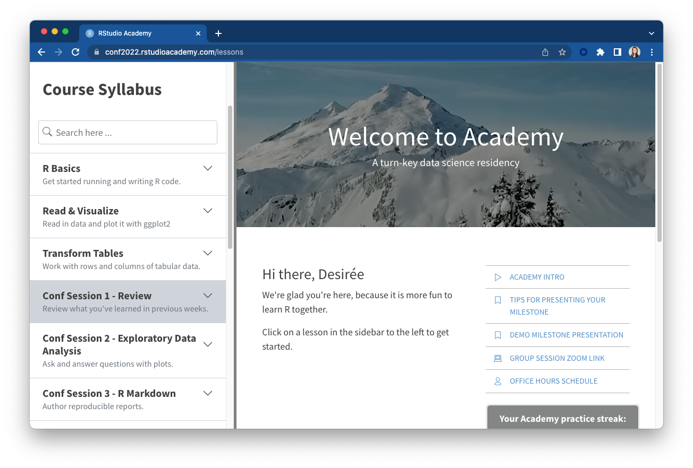

class:

```{r setup, include=FALSE}
options(htmltools.dir.version = FALSE)
knitr::opts_chunk$set(fig.retina = 3)
library(tidyverse)
```

```{r reactable-function, include=FALSE}
reactable_preview <- function(data) {
  
  page_info <- "{rowStart}-{rowEnd} of {rows} rows"
  
  if (nrow(data) > 100) {
    page_info <- glue::glue(
      "{page_info} (Total: {actual})", 
      actual = format(nrow(data), big.mark = ",")
    )
  }
  
  data %>% 
    slice_head(n = 100) %>% 
    reactable::reactable(
      defaultColDef = reactable::colDef(align = "left", maxWidth = 400),
      defaultPageSize = 8, 
      compact = TRUE,
      wrap = FALSE,
      striped = TRUE,
      sortable = FALSE, 
      showPageInfo = TRUE,
      language = reactable::reactableLang(
        pageInfo = page_info
      )
    )
}
```

```{r xaringan-stuff, include=FALSE}
xaringanExtra::use_xaringan_extra(c("tile_view", "panelset", "share_again"))
xaringanExtra::use_clipboard(selector = "pre > code.r, pre > code.md")
xaringanExtra::use_tachyons()

if (!is.null(rmarkdown::metadata$shortlink)) {
  shortlink <- rmarkdown::metadata$shortlink
  if (is.character(shortlink)) {
    shortlink <- list(url = shortlink)
  }
  stopifnot(!is.null(shortlink$url))
  
  if (is.null(shortlink$text) || !nzchar(shortlink$text)) {
    shortlink$text <- basename(shortlink$url)
  }
  
  xaringanExtra::use_banner(
    bottom_left = htmltools::tags$a(href = shortlink$url, shortlink$text),
    exclude = "title-slide"
  )
}
```


# .big-text[Welcome] 

## Introduction to the tidyverse 

Find your group's table and make yourself comfortable. 

We'll get started shortly after 9am.


<div class="title-footer">
  
  <div> </div>
</div>

---
class: middle, agenda

# Session 1 Agenda

1. Logistics: Policies, Goals, and Schedules
1. Tech and tooling
1. Review: Group challenge


---
class: middle chapter-slide blue

.big-white-number[1.]

# Policies, Goals, & Schedules 

---

class: inverse, middle

# Conference workshop policies

.left-column[

  .center[

  `r emo::ji("door")` `r emo::ji("dash")` 

  <br>

  `r emo::ji("no_entry_sign")` `r emo::ji("camera")` 
  
  <br>

  
  `r emo::ji("face_with_medical_mask")` `r emo::ji("microbe")`
  ]
]

.right-column[

  Identify the exits closest to you in case of emergency 

  <br>

  Please do not photograph people wearing .light-red[red lanyards] 
  
  <br>
   
  Fully cover your mouth and nose at all times. A limited supply of masks are available upon request. Ask at registration desk.
   
] 

---

# Code of conduct

- Please review the [rstudio::conf code of conduct](https://rstd.io/code-of-conduct) that applies to all workshops <https://rstd.io/code-of-conduct>

--

- CoC issues can be addressed three ways:

  - In person: contact any rstudio::conf staff member or the conference registration desk  
  
  - By email: send a message to `conf@rstudio.com`  
  
  - By phone: call 844-448-1212  

---
class: inverse, middle

# Locations to note

.left-column[

  .center[

  `r emo::ji("men_s_room")` `r emo::ji("water_closet")`
  
  <br>

  `r emo::ji("person_in_lotus_position")` `r emo::ji("tent")`
  
  <br>
  <br>
  
  `r emo::ji("nursing")` `r emo::ji("baby_bottle")`
  ]
]

.right-column[

  Gender neutral bathrooms are near National Harbor rooms

  <br>


  A meditation / chill-out room is open 8am - 5pm, Mon - Thurs in **National Harbor 9** if you want quiet space to recharge.
  
   <br>
   
  A lactation room is located at **Potomac Dressing Room**. Open 8am - 5pm, Mon - Thurs.
   
] 
  
---
class: middle, center, inverse

.pull-left[
# `r fontawesome::fa("fas fa-wifi")`
Wifi network name  

.light-red[`r params$wifi_network`]

]

.pull-right[
# `r fontawesome::fa("fas fa-key")`

Wifi password

.light-red[`r params$wifi_password`]

]

---
class: inverse, center, middle
background-image: url("https://images.unsplash.com/photo-1538370965046-79c0d6907d47?ixlib=rb-1.2.1&ixid=MnwxMjA3fDB8MHxwaG90by1wYWdlfHx8fGVufDB8fHx8&auto=format&fit=crop&w=2938&q=80")
background-size: cover


--

# The `tidyverse`

---
background-image: url("https://images.unsplash.com/photo-1457369804613-52c61a468e7d?ixlib=rb-1.2.1&ixid=MnwxMjA3fDB8MHxwaG90by1wYWdlfHx8fGVufDB8fHx8&auto=format&fit=crop&w=1770&q=80")
background-size: cover


---
background-image: url("https://images.unsplash.com/photo-1614935151651-0bea6508db6b?ixlib=rb-1.2.1&ixid=MnwxMjA3fDB8MHxwaG90by1wYWdlfHx8fGVufDB8fHx8&auto=format&fit=crop&w=1850&q=80")
background-size: cover


---
background-image: url("https://images.unsplash.com/photo-1584208124835-8a3d74ae211c?ixlib=rb-1.2.1&ixid=MnwxMjA3fDB8MHxwaG90by1wYWdlfHx8fGVufDB8fHx8&auto=format&fit=crop&w=1084&q=80")
background-size: cover


---
background-image: url("https://images.unsplash.com/photo-1517245386807-bb43f82c33c4?ixlib=rb-1.2.1&ixid=MnwxMjA3fDB8MHxwaG90by1wYWdlfHx8fGVufDB8fHx8&auto=format&fit=crop&w=1770&q=80")
background-size: cover


---

background-image: url("https://images.unsplash.com/photo-1562411052-105105232432?ixlib=rb-1.2.1&ixid=MnwxMjA3fDB8MHxwaG90by1wYWdlfHx8fGVufDB8fHx8&auto=format&fit=crop&w=1771&q=80")
background-size: cover


---
background-image: url("https://images.unsplash.com/photo-1519389950473-47ba0277781c?ixlib=rb-1.2.1&ixid=MnwxMjA3fDB8MHxwaG90by1wYWdlfHx8fGVufDB8fHx8&auto=format&fit=crop&w=1770&q=80")
background-size: cover


---
background-image: url("https://images.unsplash.com/photo-1500106067612-d3b2531fc762?ixlib=rb-1.2.1&ixid=MnwxMjA3fDB8MHxwaG90by1wYWdlfHx8fGVufDB8fHx8&auto=format&fit=crop&w=928&q=80")
background-size: cover


---
class: center, top
background-image: url(https://images.unsplash.com/photo-1520962880247-cfaf541c8724?ixlib=rb-1.2.1&ixid=MnwxMjA3fDB8MHxwaG90by1wYWdlfHx8fGVufDB8fHx8&auto=format&fit=crop&w=1332&q=80)
background-position: center
background-size: cover

# Goals


--

Drill old wrangling skills and explore new ones

--

Learn best practices for exploring your data and reporting it reproducibly 

---
class: center, middle, chapter-slide red

.big-text.white.center[Hello!]


---
class: speaker-slide

# `r rmarkdown::metadata$author`

<!-- You can copy the image link address from your github profile to use as the src link below --> 


.speaker-links[
[`r fontawesome::fa("github")` dcossyleon](https://github.com/dcossyleon)    
[`r fontawesome::fa("twitter")` dcossyle](https://twitter.com/dcossyle)   
[`r fontawesome::fa("link")` desiree.rbind.io](https://desiree.rbind.io)
]


---
class: center

# Meet the team

<div class="cf-ns nl2 nr2">
  <div class="fl-ns w-20-ns pv4">
    <div class="tc">
      
    </div>
    <div class="f6 fw6 gray ttu tracked mt2">
      Kristin Bott
    </div>
  </div>


  <div class="fl-ns w-20-ns pv4">
    <div class="tc">
      
    </div>
    <div class="f6 fw6 gray ttu tracked mt2">
      Brendan Cullen
    </div>
  </div>
  
  
  <div class="fl-ns w-20-ns pv4">
    <div class="tc">
      
    </div>
    <div class="f6 fw6 gray ttu tracked mt2">
      Daniel Chen
    </div>
  </div>
  
  
  <div class="fl-ns w-20-ns pv4">
    <div class="tc">
      
    </div>
    <div class="f6 fw6 gray ttu tracked mt2">
      Sara Altman
    </div>
  </div>
  
  <div class="fl-ns w-20-ns pv4">
    <div class="tc">
      
    </div>
    <div class="f6 fw6 gray ttu tracked mt2">
      Deirdre Francks
    </div>
  </div>
  
  <div class="fl-ns w-20-ns pv4">
    <div class="tc">
      
    </div>
    <div class="f6 fw6 gray ttu tracked mt2">
Steven Smallberg    </div>
  </div>
  
  
  <div class="fl-ns w-20-ns pv4">
    <div class="tc">
      
    </div>
    <div class="f6 fw6 gray ttu tracked mt2">
Laura Puckett    </div>
  </div>
  
  
  <div class="fl-ns w-20-ns pv4">
    <div class="tc">
      
    </div>
    <div class="f6 fw6 gray ttu tracked mt2">
      Garrett Grolemund    
    </div>
  </div>
  
  
  <div class="fl-ns w-20-ns pv4">
    <div class="tc">
      
    </div>
    <div class="f6 fw6 gray ttu tracked mt2">
      Dan Buch
    </div>
  </div>
  
  <div class="fl-ns w-20-ns pv4">
    <div class="tc">
      
    </div>
    <div class="f6 fw6 gray ttu tracked mt2">
      Garrick Aden-Buie
    </div>
  </div>
  
  
  
</div>


---
class: middle, center
background-image: url("images/session01/scooters.jpg")
background-size: cover


---
class: middle, center
background-image: url("images/session01/scooters-dark.png")
background-size: cover

# .big-text.white[The Lineup]


---
class: middle, center 

.pull-left[

# Day One:

### Review + Best Practices 

]


--

.pull-right[

# Day Two:

### Transformation + Milestone  

]


---
class: middle, center

.pull-left[

# Day One:

### Review + Best Practices

Review

Exploratory data analysis

R Markdown for reproducible results

R Projects and your local IDE
]

.pull-right[
# Day Two:

### Transformation + Milestone  

]


--

.pull-right[

Summarize data and work with groups

Recoding variables + Milestone recreation

Lightning talks + Milestone extension

Milestone presentation
]

---
class: center


.left-column1[

# Schedule

.spaced[

| Time          | Activity                                                      |
|:--------------|:--------------------------------------------------------------|
| 09:00 - 10:30 | Session 1                                                     |
| 10:30 - 11:00 | *Break* `r emo::ji("coffee")`                                 |
| 11:00 - 12:30 | Session 2                                                     |
| 12:30 - 01:30 | *Lunch* `r emo::ji("bento")`                                  |  
| 01:30 - 03:00 | Session 3                                                     |
| 03:00 - 03:30 | *Break* `r emo::ji("tea")`                                    |
| 03:30 - 05:00 | Session 4                                                     |

]
]


--

.right-column63[
# Workspace

]


---
class: chapter-slide, tan, middle

.big-white-number[2.]

# Tech and tooling


---
class: inverse, middle, center
.pull-left[
  ### Presenting

]


---
class: inverse, middle, center

.pull-left[
  
  ### Presenting

  ```{r zoom, echo = FALSE, out.width = "25%"}
  knitr::include_graphics("images/session01/zoom.png")
  ```

]


---
class: inverse, middle, center

.pull-left[
  
  ### Presenting

  ```{r ref.label = "zoom", echo = FALSE, out.width = "25%"}
  ```

  Muted 
  
  No camera  
  
  Your group session link  

]


--

.pull-right[
  ### Code + Announcements

  <br>
    
  ```{r slack, echo = FALSE, out.width = "40%"}
  knitr::include_graphics("images/session01/slack.png")
  ```

  <br>
  
  Your group's slack channel  
  
  `#intro-to-tidyverse`
  
]

---
class: inverse, center, middle

.pull-left[

## Done! 

```{r g, echo = FALSE}

```
]


--

.pull-right[

## Help! 

```{r p, echo = FALSE}
knitr::include_graphics("images/session01/pink-square.png")
```
]


---
class: middle, chapter-slide green

.big-white-number[3.]

# Review: Group challenge


---
class: inverse

.big-text.white[
# Questions?
]


---
class: title-slide

# `r rmarkdown::metadata$title`

### `r rmarkdown::metadata$subtitle`

<div class="title-footer">
  
  <div> `r rmarkdown::metadata$author` • `r rmarkdown::metadata$date`</div>
</div>


---
class: inverse

### Go to **Conf Session 1 - Review**

.center[
```{r session1-workspace, echo = FALSE, out.width = "80%", fig.align = "center"}

```
]


---

## `r emo::ji("rocket")` Rapid fire review 


```{r label, echo = FALSE}
knitr::include_graphics("images/session01/your-turn-example.png")
```


---

# Review challenge rules

* For each prompt, the __first group with 4 or more people to have the answer correct__ (as verified by your mentor), scores a point.

--

* You must have the __correct code__ *and* the __correct output__.

--

* __Working together__ with your groupmates is encouraged.

--

* After 1-2 minutes, we'll go over the answer together. And then move on to the next question. 

--

* Group with the most points at the end wins (a small prize!)


---
class: inverse, center, middle

.pull-left[

## Done! 

```{r, echo = FALSE}

```
]

.pull-right[

## Help! 

```{r, echo = FALSE}
knitr::include_graphics("images/session01/pink-square.png")
```
]


---
class: center, middle


# .big-text[Questions?]


---
class: center, middle
background-image: url(https://images.unsplash.com/photo-1579780864813-863e246d3bc5?ixlib=rb-1.2.1&ixid=MnwxMjA3fDB8MHxwaG90by1wYWdlfHx8fGVufDB8fHx8&auto=format&fit=crop&w=1160&q=80)
background-position: center
background-size: cover


---
class: center, middle, inverse
background-image: url(https://images.unsplash.com/photo-1579780864813-863e246d3bc5?ixlib=rb-1.2.1&ixid=MnwxMjA3fDB8MHxwaG90by1wYWdlfHx8fGVufDB8fHx8&auto=format&fit=crop&w=1160&q=80)
background-position: center
background-size: cover

```{r load-data, include=FALSE}
library(tidyverse)

readxl::read_excel("data/session01/NationalOutbreakPublicDataTool.xlsx", sheet = 1) %>%
  janitor::clean_names() %>%
  readr::write_csv("data/session01/outbreaks.csv")
```

# .big-text[`outbreaks`]


