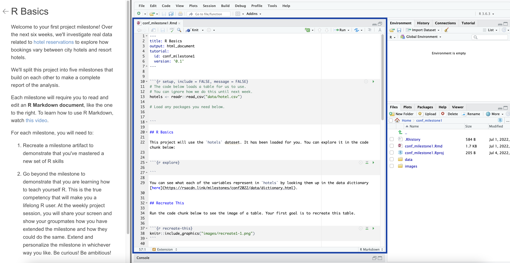
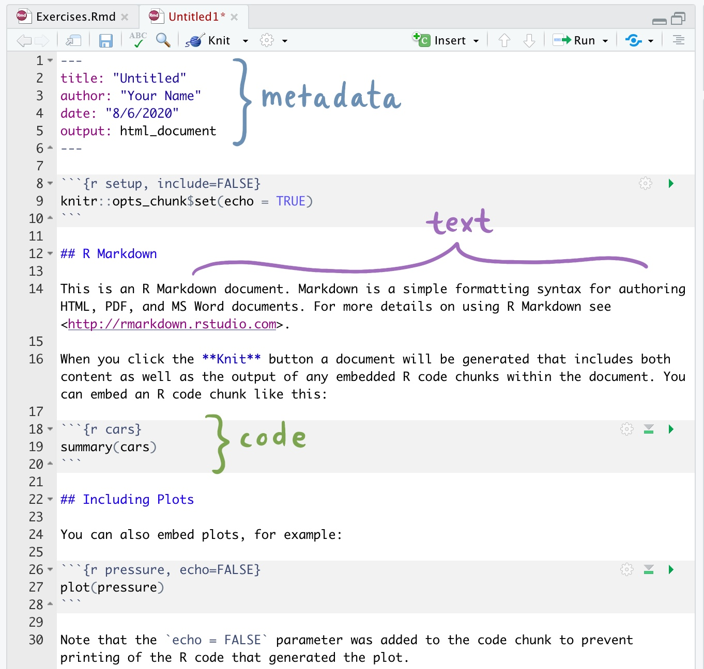
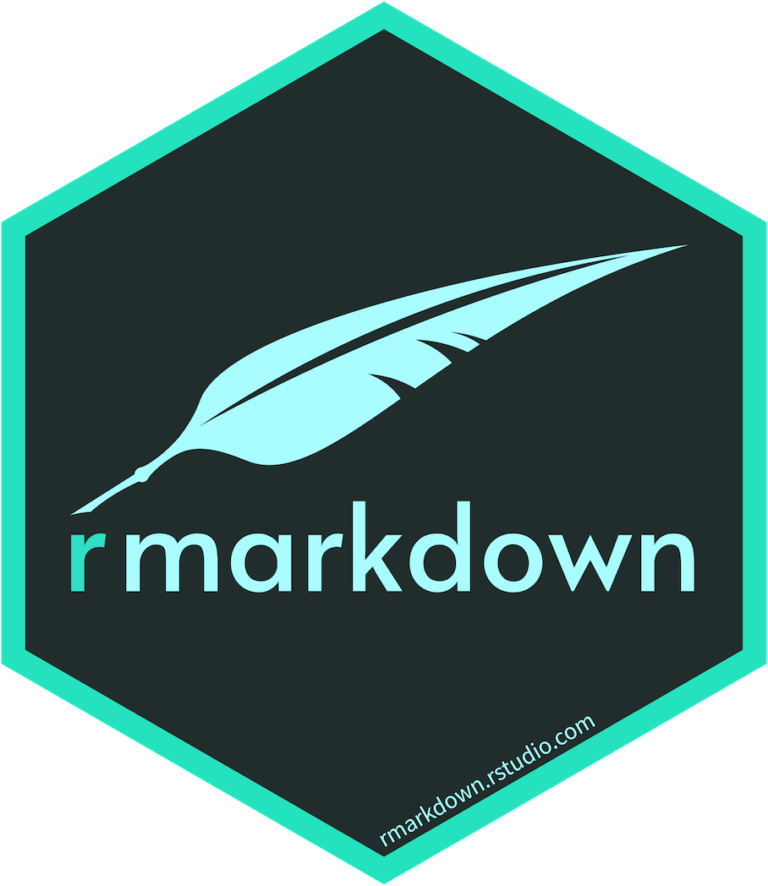
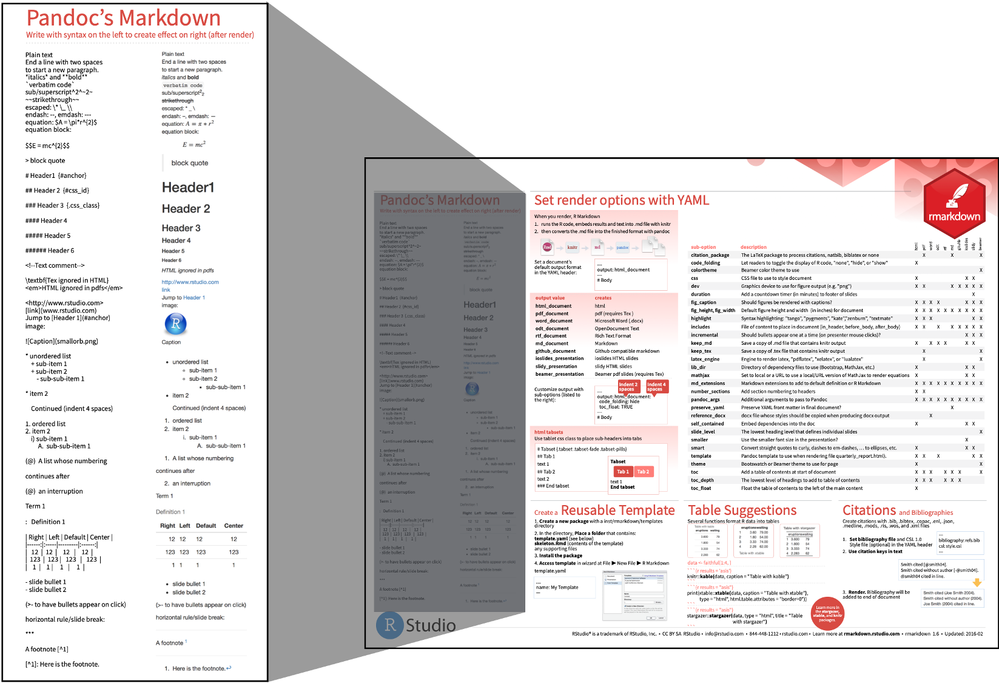
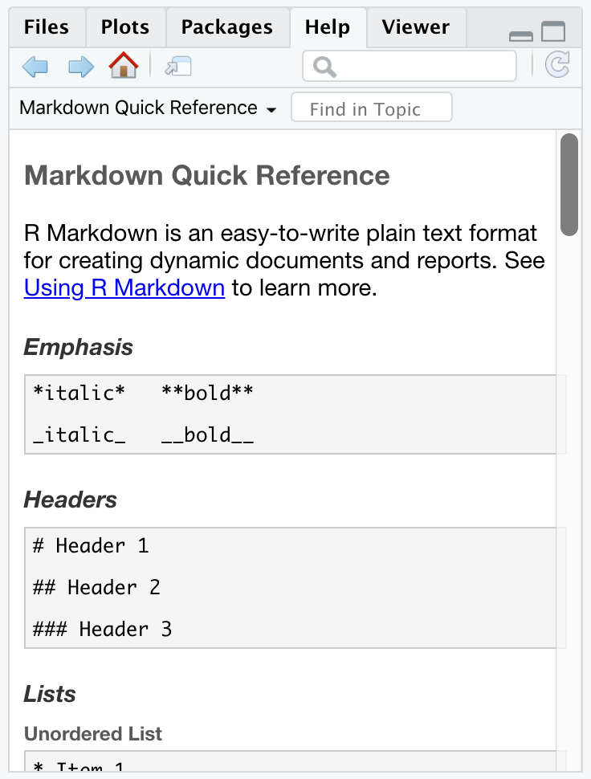
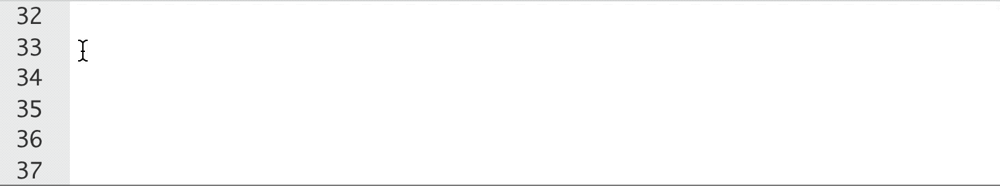
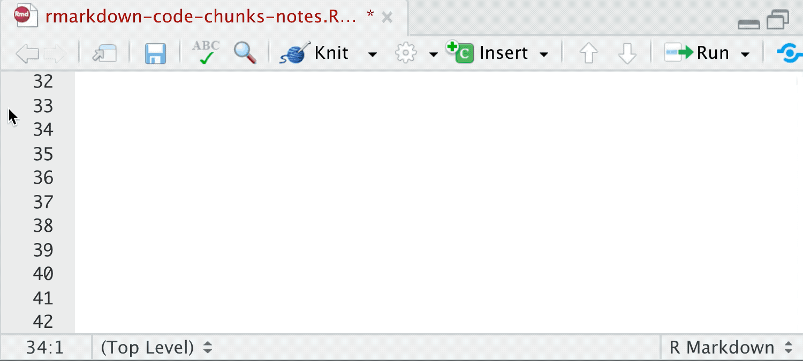
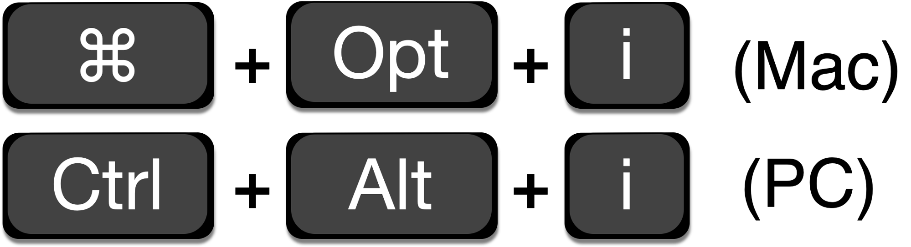
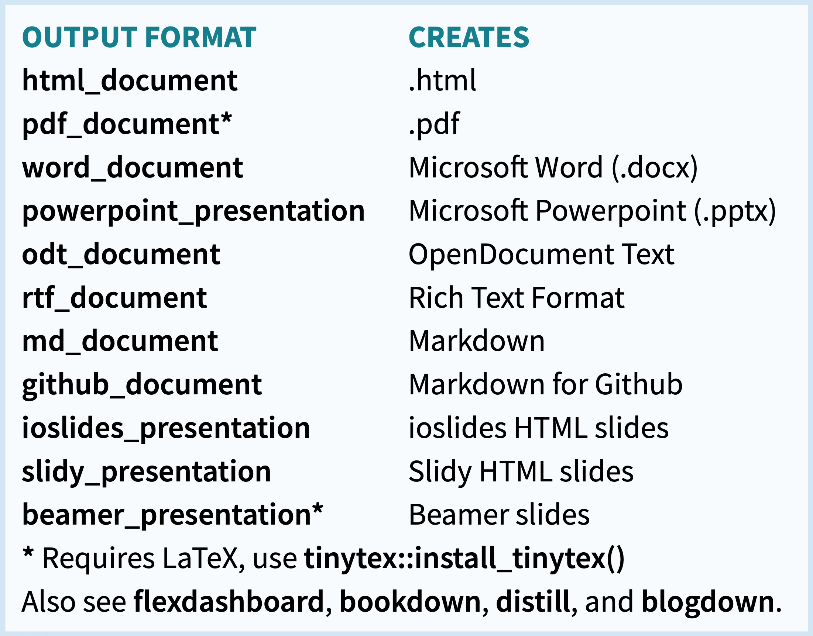

class: title-slide

```{r setup, include=FALSE}
options(htmltools.dir.version = FALSE)

# Load packages
library(countdown)
library(ymlthis)
library(tidyverse)
```

# `r rmarkdown::metadata$title`

### `r rmarkdown::metadata$subtitle`

<div class="title-footer">
  
  <div> `r rmarkdown::metadata$author` • `r rmarkdown::metadata$date`</div>
</div>


```{r xaringanExtra, echo=FALSE}
xaringanExtra::use_xaringan_extra(c("tile_view", "panelset", "share_again"))
xaringanExtra::use_clipboard(selector = "pre > code.r, pre > code.md")

if (!is.null(rmarkdown::metadata$shortlink)) {
  shortlink <- rmarkdown::metadata$shortlink
  if (is.character(shortlink)) {
    shortlink <- list(url = shortlink)
  }
  stopifnot(!is.null(shortlink$url))
  
  if (is.null(shortlink$text) || !nzchar(shortlink$text)) {
    shortlink$text <- basename(shortlink$url)
  }
  
  xaringanExtra::use_banner(
    bottom_left = htmltools::tags$a(href = shortlink$url, shortlink$text),
    exclude = "title-slide"
  )
}
```

---
class: speaker-slide

# `r rmarkdown::metadata$author`

<!-- You can copy the image link address from your github profile to use as the src link below --> 


.speaker-links[
[`r fontawesome::fa("github")` brendanhcullen](https://github.com/brendanhcullen)    
[`r fontawesome::fa("twitter")` _bcullen](https://twitter.com/_bcullen)   
[`r fontawesome::fa("link")` bcullen.rbind.io](https://bcullen.rbind.io/)
]

---
# Thank you

Thanks to Garrett Grolemund, Alison Hill and Desirée De Leon for their roles with making these materials!

---
class: middle

# Agenda

1. What is R Markdown?
1. Why use R Markdown?
1. The 3 essential ingredients
  - Text
  - Code
  - Metadata

---
class: middle chapter-slide red

.big-white-number[1.]

# What is R Markdown?

---
# What is R Markdown?

`r emo::ji("writing_hand")` An authoring framework for data science

--

`r emo::ji("floppy_disk")` A file format (`.Rmd`)

--

`r emo::ji("package")` An [R package](https://rmarkdown.rstudio.com/docs/) (rmarkdown)

--

`r emo::ji("hammer_and_wrench")` A tool for integrating prose, code, and output

--

`r emo::ji("sparkles")` Magic

---
# What's in a `.Rmd`?

.pull-left[

`r emo::ji("page_with_curl")` Text and headers

`r emo::ji("computer")` R code

`r emo::ji("bar_chart")` Output (e.g. plots, tables, model results)

`r emo::ji("framed_picture")` Images

... and more!
]

.pull-right[
```{r echo=FALSE, out.width="100%"}
knitr::include_graphics("images/session03-rmarkdown/doc-make.jpg")
```
]

---

# Does this look familiar?

```{r echo=FALSE, out.width="80%"}

```

---
class: middle chapter-slide blue

.big-white-number[2.]

# Why use R Markdown? 

---
# Replication crisis

---
# Reproducibility crisis

---
background-image: url(images/session03-rmarkdown/reproducibility.gif)
background-position: center;
background-size: 100% 

---
class: middle chapter-slide green

.big-white-number[3.]

# The 3 essential ingredients

---
# The 3 essential ingredients

.pull-left[
## 1. Text

## 2. Code

## 3. Metadata
]

.pull-right[
```{r echo=FALSE, out.width="90%"}

```
]

---
# The 3 essential <span style="color:red">frameworks</span>

.pull-left[
## 1. Text &rarr; <span style="color:red">Markdown</span>

## 2. Code &rarr; <span style="color:red">knitr</span>

## 3. Metadata &rarr; <span style="color:red">YAML</span>
]

.pull-right[
```{r echo=FALSE, out.width="90%"}

```
]

---

class: inverse middle center

# Text
## Markdown

---

# Text

.pull-left[
````markdown
Regular text


_italics_


**bold**  


`code`  
````
]

.pull-right[
Regular text

_italics_

**bold**  

`code`
]
---

# Headers

.pull-left[
```markdown
# Header 1

## Header 2

### Header 3

#### Header 4

##### Header 5

###### Header 6
```
]

.pull-right[
# Header 1

## Header 2

### Header 3

#### Header 4

##### Header 5

###### Header 6
]

---
# Lists

.panelset[
.panel[.panel-name[Bulleted]

.pull-left[

```markdown
Bulleted list

* bullet 1
* bullet 2
```

]

.pull-right[

Bulleted list

* bullet 1
* bullet 2
]
]

.panel[.panel-name[Numbered]

.pull-left[

```markdown
Numbered list

1. item 1
1. item 2
```

]

.pull-right[
Numbered list

1. item 1
2. item 2

]
]
]

---
# Images

```markdown

```

<figure>

</figure>

---
# Images


```markdown

```

```{css, echo=FALSE}
figure {
  font-size: 30px;
}
```

<figure>

<figcaption>Hex logo</figcaption>
</figure>

---
# Images

```markdown
{width=50%}
```

<figure>

<figcaption>Hex logo</figcaption>
</figure>

---

# Links

```markdown
Read more about R Markdown [here](https://rmarkdown.rstudio.com/).
```

Read more about R Markdown [here](https://rmarkdown.rstudio.com/).

---
# Resources 

<!-- TODO: update image -->

.pull-left[

<p style="font-style: italic; font-size:26px;"> Help > Cheatsheets > R Markdown Cheat Sheet </p>

```{r echo=FALSE}

```
]

.pull-right[

<p style="font-style: italic; font-size:26px;"> Help > Markdown Quick Reference </p>

```{r echo=FALSE, out.width="50%"}

```
]

---
class: your-turn

# Your Turn 1

.panelset[
.panel[.panel-name[Overview]

1. Open `your_turn_01.Rmd`.

1. Inspect the contents of <a href="https://rsacdn.link/milestones/conf2022/session03-rmarkdown/data/your_turn_01_solution.html" rel="noopener noreferrer" target="_blank">this HTML output</a>.

1. Add markdown formatting to `your_turn_01.Rmd` to re-create the HTML output.

]

.panel[.panel-name[Steps]

1. Add Level-1 and Level-2 headers

1. Add a bulleted list

1. Add a [hyperlink](https://www.americangemsociety.org/4cs-of-diamonds/)

1. Add an image (saved in the `images/` directory)

1. Add _italicized_ and **bolded** text
]
]

```{r echo = FALSE}
countdown::countdown(minutes = 4)
```

---
class: inverse middle center

# Code
## knitr

---
# Add a code chunk


.panelset[
.panel[.panel-name[Option 1]
```{r echo=FALSE}

```
]

.panel[.panel-name[Option 2]
```{r echo=FALSE, out.width="70%"}

```
]

.panel[.panel-name[Option 3]
```{r echo=FALSE, out.width="70%"}

```
]
]

---
# Chunk options

By default, code and output are both displayed.

.pull-left[

````
```{r}`r ''`
ggplot(mpg) + 
  geom_point(aes(displ, hwy))
```
````
]

.pull-right[
```{r out.width = "50%"}
ggplot(mpg) + 
  geom_point(aes(displ, hwy))
```
]

---
# `echo`

`echo = FALSE` hides the code. Especially useful for plots!

.pull-left[

````
```{r echo=FALSE}`r ''`
ggplot(mpg) + 
  geom_point(aes(displ, hwy))
```
````
]

.pull-right[
```{r echo=FALSE, out.width = "50%"}
ggplot(mpg) + 
  geom_point(aes(displ, hwy))
```
]

---
# `eval`

`eval = FALSE` prevents the code from being run.

.pull-left[

````
```{r eval=FALSE}`r ''`
ggplot(mpg) + 
  geom_point(aes(displ, hwy))
```
````
]

.pull-right[
```{r eval=FALSE, out.width = "50%"}
ggplot(mpg) + 
  geom_point(aes(displ, hwy))
```
]

---
# `include`

`include = FALSE` runs the code, but prevents both the code and the output from appearing. 

.pull-left[

````
```{r include=FALSE}`r ''`
ggplot(mpg) + 
  geom_point(aes(displ, hwy))
```
````
]

.pull-right[
[no code or output shown]
]

---
# Chunk labels

.pull-left[

````
```{r peek}`r ''`
glimpse(mpg)
```
````

* Place label between curly braces <br> `{r peek}`

* Add chunk options after comma <br> `{r peek, echo=FALSE}`

]

--

.pull-right[

````
```{r peek}`r ''`
head(mpg)
```
````

````
Error in parse_block(g[-1], g[1], params.src) : 
  duplicate label 'peek'
Calls: <Anonymous> ... process_file -> split_file -> lapply -> FUN -> parse_block
Execution halted
````

`r emo::ji("warning")` Careful! No duplicate chunk labels

]

???

how can we make it easier on ourselves to explore the code in here?

show how to add chunk labels and view in IDE interactively

---
# Chunk labels 

`r emo::ji("bulb")` Think "kebabs, not snakes"

.pull-left[

.center[

**Good**

`my-plot`

`myplot`

`myplot1`

`MY-PLOT`

]

]

.pull-right[

.center[

**Bad**

`my_plot`

`my plot`

...everything else!

]
]

---
# `r emo::ji("yarn")` Knit

.center[
```{r echo=FALSE, out.width="100%"}
knitr::include_graphics("https://d33wubrfki0l68.cloudfront.net/61d189fd9cdf955058415d3e1b28dd60e1bd7c9b/9791d/images/rmarkdownflow.png")
```
]

.footnote[
Image: [R for Data Science](https://r4ds.had.co.nz/r-markdown.html#r-markdown-basics)
]

???
When you knit the document, R Markdown sends the .Rmd file to knitr, which executes all of the code chunks and creates a new markdown (.md) document which includes the code and its output. 

---
# `r emo::ji("yarn")` Knit

TODO: Add recorded demo of knitting a .Rmd document

---
class: your-turn

# Your Turn 2

.panelset[
.panel[.panel-name[Overview]

1. Open `your_turn_02.Rmd`.

1. Inspect the contents of <a href="https://rsacdn.link/milestones/conf2022/session03-rmarkdown/data/your_turn_02_solution.html" rel="noopener noreferrer" target="_blank">this HTML output</a>.

1. Add **chunk options** to `your_turn_02.Rmd` to re-create the HTML output.

]

.panel[.panel-name[Steps]

1. Hide the code and output of the setup chunk

1. Hide the code for all plots

1. Bonus: Add descriptive labels to your code chunks

]
]

```{r echo = FALSE}
countdown::countdown(minutes = 4)
```

---
# Resources 

TODO: add image of chunk options in cheatsheet

---
class: inverse middle center

# Metadata
## YAML

---
# YAML

[_"YAML Ain't Markup Language"_](https://en.wikipedia.org/wiki/YAML#History_and_name)

A section of `key: value` pairs separated by dashes <code>---</code>

```yaml
---
key: value
---
```

---
# YAML

.pull-left[

```{r echo = FALSE}
yml_empty() %>% 
 yml_author("Brendan Cullen") %>% 
 yml_title("Diamonds Exploration") %>% 
 yml_output(html_document()) %>% 
 asis_yaml_output()
```
]

--

.pull-right[

```{r echo = FALSE}
yml_empty() %>%
 yml_author("Brendan Cullen") %>% 
 yml_title("Diamonds Exploration") %>% 
  yml_output(html_document(
    toc = TRUE
  )) %>%
  asis_yaml_output()
```

.center[
Add a table of contents
]
]

---
# YAML

.pull-left[

```{r echo = FALSE}
yml_empty() %>% 
 yml_author("Brendan Cullen") %>% 
 yml_title("Diamonds Exploration") %>% 
 yml_output(html_document()) %>% 
 asis_yaml_output()
```
]

.pull-right[

```{r echo = FALSE}
yml_empty() %>%
 yml_author("Brendan Cullen") %>% 
 yml_title("Diamonds Exploration") %>% 
  yml_output(html_document(
    toc = TRUE,
    toc_float = TRUE
  )) %>%
  asis_yaml_output()
```

.center[
Add a table of contents

Make it a **floating** table of contents
]
]

---
# YAML - indentation matters!

.pull-left[

````
---
author: Brendan Cullen
title: Diamonds Exploration
output:
html_document:
toc: true
toc_float: true
---
````
.center[
`r emo::ji("x")`
]

]


.pull-right[

```{r echo = FALSE}
yml_empty() %>%
 yml_author("Brendan Cullen") %>% 
 yml_title("Diamonds Exploration") %>% 
  yml_output(html_document(
    toc = TRUE,
    toc_float = TRUE
  )) %>%
  asis_yaml_output()
```

.center[
`r emo::ji("white_check_mark")`

Indent **format** 2 characters<br> Indent **options** 4 characters
]
]

---
# Built-in output formats

<!-- TODO: update image -->

.left-column[
```{r echo=FALSE}
knitr::include_graphics("images/session03-rmarkdown/output-formats.png")
```
]

.right-column[
```{r echo=FALSE}

```
]

---
# Extension output formats

```{r echo=FALSE, out.width="32%"}
knitr::include_graphics("https://raw.githubusercontent.com/rstudio/hex-stickers/master/PNG/flexdashboard.png")

knitr::include_graphics("https://raw.githubusercontent.com/rstudio/hex-stickers/master/PNG/bookdown.png")

knitr::include_graphics("https://raw.githubusercontent.com/rstudio/hex-stickers/master/PNG/xaringan.png")
```

---
class: your-turn

# Your Turn 3

.panelset[
.panel[.panel-name[Overview]

1. Open `your_turn_03.Rmd`.

1. Inspect the contents of <a href="https://rsacdn.link/milestones/conf2022/session03-rmarkdown/data/your_turn_03_solution.html" rel="noopener noreferrer" target="_blank">this HTML output</a>.

1. Add **YAML metadata** to `your_turn_03.Rmd` to re-create the HTML output.

]

.panel[.panel-name[Steps]

1. Add a floating table of contents

1. Apply the `flatly` theme to your document

1. Add a "Code Download" button

1. Print the `diamonds` dataset as a paged table

]
]

```{r echo = FALSE}
countdown::countdown(minutes = 4)
```


---
# Take-aways

--

`r emo::ji("heavy_check_mark")` **Document your document:** use YAML to set up meaningful metadata

--

`r emo::ji("heavy_check_mark")` **Style your document:** use YAML to add options to your chosen output format

--

`r emo::ji("heavy_check_mark")` **Style your text:** use markdown for **bold**, _italics_, `code`, `r fontawesome::fa("list")` bullets and `r fontawesome::fa("list-ol")` lists

--

`r emo::ji("heavy_check_mark")` **Style your output:** use knitr chunk options

--

`r emo::ji("heavy_check_mark")` **Organize your text:** use markdown headers with `#`

--

`r emo::ji("heavy_check_mark")` **Organize your code:** use knitr chunk labels

--

`r emo::ji("heavy_check_mark")` **Preview your work:** `r emo::ji("yarn")` early, `r emo::ji("yarn")` often

---
class: inverse, center, middle

# Demo

---
class: your-turn

# Mini Project

**Create a polished R Markdown report that summarizes your exploratory data analysis of the `wines` dataset.** 

Be sure to use markdown formatting, knitr chunk options and YAML metadata.

We'll leave some time at the end for you to share your report with your group. 
 
```{r echo = FALSE}
countdown::countdown(minutes = 20)
```
