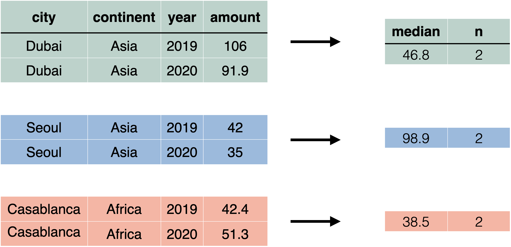

---
class: title-slide

```{r setup, include=FALSE}
options(htmltools.dir.version = FALSE)
library(tidyverse)
library(babynames)
```

# `r rmarkdown::metadata$title`

### `r rmarkdown::metadata$subtitle`

<div class="title-footer">
  
  <div> `r rmarkdown::metadata$author` • `r rmarkdown::metadata$date`</div>
</div>


```{r xaringanExtra, echo=FALSE}
xaringanExtra::use_xaringan_extra(c("tile_view", "panelset"))
xaringanExtra::use_clipboard(selector = "pre > code.r, pre > code.md")
if (!is.null(rmarkdown::metadata$shortlink)) {
  shortlink <- rmarkdown::metadata$shortlink
  stopifnot(!is.null(shortlink$url))
  
  if (is.null(shortlink$text) || !nzchar(shortlink$text)) {
    shortlink$text <- basename(shortlink$url)
  }
  
  htmltools::HTML(sprintf(
    '<script>document.addEventListener("DOMContentLoaded", function() {
  document
    .querySelectorAll(".remark-slides-area .remark-slide-content")
    .forEach(function(el) {
      const link = document.createElement("a")
      link.classList = "footer-link"
      link.href = "%s"
      link.innerText = "%s"
      el.appendChild(link)
    })
  })</script>',
    shortlink$url,
    shortlink$text
  ))
}
```

---
class: speaker-slide

# `r rmarkdown::metadata$author`

<!-- You can copy the image link address from your github profile to use as the src link below --> 


.speaker-links[
[`r fontawesome::fa("github")` dcossyleon](https://github.com/skaltman)]

---

class: middle

# Agenda slide

1. Review R Markdown
1. `summarize()`
1. Helpful summary functions
1. Create grouped summaries


---
class: middle chapter-slide red

.big-white-number[1.]

# `summarize()`

---
# `babynames`

```{r}
library(babynames)
head(babynames)
```

???

The `babynames()` dataset, from the babynames package, includes US baby name data from the SSA. Each row represents a name, sex, year combination, and provides the number of babies and proportion of babies with that name. Only names with at least five uses are included.

---
# What's the total number of babies in `babynames`?

```{r eval=FALSE}
babynames %>% 
  summarize(              )
```

---
# What's the total number of babies in `babynames`?

```{r}
babynames %>% 
  summarize(total = sum(n))
```

???
`summarize()` collapses a column of information into a single row. In this case, `summarize()` takes the `n` column, sums all the numbers in that column, and returns it as the column `total`

---
# Max number of babies with a name

```{r}
babynames %>% 
  summarize(max = max(n))
```

???
We can use other functions like `max()` and `min()` to find the minimum and maximum numbers that occur in `n`. 

---
class: your-turn

# Your Turn

Complete the code to extract rows where `name == [your name]`. Then, use `summarize()`, `sum()`, and `min()` to find:

2. The total number of children with your name.
3. The first year your name appeared in the data.

(If you don't find your name in the data, try one of these names, which have interesting results: Khaleesi, Anakin)

```{r echo = FALSE}
countdown::countdown(minutes = 5)
```

---

```{r}
babynames %>% 
  filter(name == "Sara") %>% 
  summarize(
    total = sum(n),
    first = min(year)
  )
```

---
class: middle chapter-slide blue

.big-white-number[2.]

# Summary functions

---
- Take a vector as input
- Return a single value as output

[diagram]

---


---
# `n()`

Find the number of rows in a datas et or group

```{r}
babynames %>% 
  summarize(n_rows = n())
```

---
# `n_distinct()`

Find the number of distinct values in a column

```{r}
babynames %>% 
  summarize(
    n_rows = n(),
    n_names = n_distinct(name)
  )
```

---
# Name popularity 

A name is popular if a large number of children have the name when you sum across years

--

```{r}
babynames %>% 
  filter(name == "Sara") %>% 
  summarize(total = sum(n))
```
--

What if we want to do this for every name?

???
We're going to need to group cases together by name. Before we tackle this task, 
we'll look at groups with a simpler data set. 

---
class: middle chapter-slide green

.big-white-number[2.]

# Grouping cases

---


---

```{r echo=FALSE}
pollution <-
  tribble(
    ~city,      ~pollution_size,   ~amount,
    "New York", "large",           23,
    "New York", "small",           14,
    "London",   "large",           22,
    "London",   "small",           16,
    "Beijing",  "large",           121,
    "Beijing",  "small",           56
  )
```

--

```{r}
pollution %>% 
  summarize(mean = mean(amount))
```

???
Earlier, we learned how to use `summarize()` to summarize information in a tibble. 
For example, we could find the mean amount of pollution by using `summarize()` and `mean()`.

However, this code just tells us these summary facts about the _entire_ dataset. What 
if we want to know the average for each city? Or by particle size?

---
# Group and summarize



???
We want to _group by_ the name of the city, and calculate the average `amount` 
for each of these groups, generating three different numbers. One for New York,
one for London, and one for Beijing. 

---
# `group_by()` 

```{r eval=FALSE}
pollution %>% 
  group_by(city)
```


???

To do so, we'll use a function called `group_by()`. When you provide `group_by()`
with a column, it groups the data by that column. 

You can see these groups in the header of the tibble. 

---

# `group_by()` + `summarize()`

```{r eval=FALSE}
pollution %>% 
  group_by(city) %>% 
  summarize(mean = mean(amount))
```


???
Our next step is `summarize()`. When applied to a grouped tibble, `summarize()` will
summarize each of the groups. 

Now, we have three rows, each summarizing the mean amount of pollution in a single city. We've collapsed the two rows
for each city into a single row for each city. 

---

# Group by multiple columns

```{r}
pollution %>% 
  group_by(city, pollution_size) %>% 
  summarize(mean = mean(amount))
```


???
We can group by multiple columns as well.

---

# Summarize multiple variables 

```{r}
pollution %>% 
  group_by(city, pollution_size) %>% 
  summarize(
    mean = mean(amount), 
    sum = sum(amount)
  )
```

???
As well as summarize multiple variables when grouped

---
class: your-turn

# Your Turn

Find... (using a pollution2 dataset)

```{r echo = FALSE}
countdown::countdown(minutes = 3)
```

---

# Undoing groups

```{r}
pollution %>% 
  group_by(city)
```

```{r}
pollution %>% 
  group_by(city) %>% 
  summarize(mean = mean(amount))
```


???
`group_by()` groups by common values. `summarize()` undoes the grouping. 
Notice that the `Groups` box is gone after we `summarize()`. 

---
# Be careful

```{r}
pollution %>% 
  group_by(city, pollution_size) %>% 
  summarize(mean = mean(amount))
```


???
`summarize()` only undoes one layer of grouping. We are still grouped by `city`. 

---
# Ungroup

```{r}
pollution %>% 
  group_by(city, pollution_size) %>% 
  summarize(mean = mean(amount)) %>% 
  ungroup()
```


???
To undo any groupings, use the function `ungroup()`.

---
class: your-turn

# Your Turn

Complete the code with `group_by()`, `summarize()`,  and `arrange()` to display the ten most popular name and sex combinations. Compute popularity as the total number of children with a given name and sex. 

```{r echo = FALSE}
countdown::countdown(minutes = 3)
```

---

```{r}
babynames %>% 
  group_by(name, sex) %>% 
  summarize(total = sum(n)) %>% 
  arrange(desc(total))
```

---

```{r}
babynames %>% 
  group_by(name, sex) %>% 
  summarize(total = sum(n)) %>% 
  arrange(desc(total)) %>% 
  ggplot(aes(name, total, color = sex)) +
  geom_col()
```

---
class: your-turn

# Your Turn

Use `group_by()` to calculate the total number of children born for every year. 
Plot the results as a line graph: total vs. year. 

```{r echo = FALSE}
countdown::countdown(minutes = 3)
```