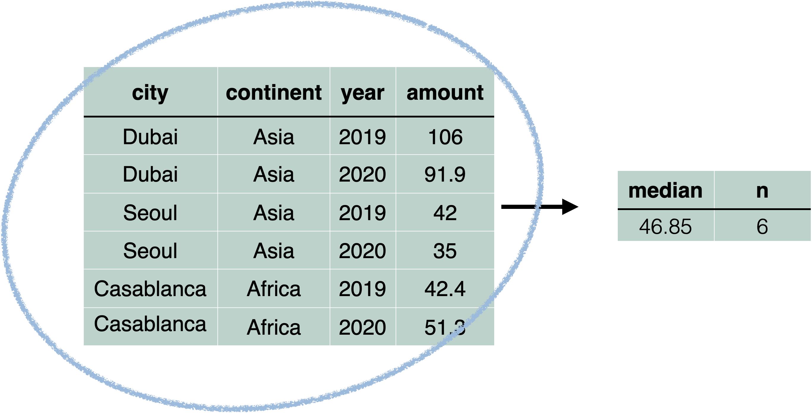

---
class: title-slide

```{r setup, include=FALSE}
options(htmltools.dir.version = FALSE, dplyr.summarise.inform = FALSE)

hook_source <- knitr::knit_hooks$get('source')
knitr::knit_hooks$set(source = function(x, options) {
  x <- stringr::str_replace(x, "^[[:blank:]]?([^*].+?)[[:blank:]]*#<<[[:blank:]]*$", "*\\1")
  hook_source(x, options)
})

library(tidyverse)
library(babynames)

pollution <- read_csv("data/session05/pollution.csv")
```

# `r rmarkdown::metadata$title`

### `r rmarkdown::metadata$subtitle`

<div class="title-footer">
  
  <div> `r rmarkdown::metadata$author` • `r rmarkdown::metadata$date`</div>
</div>


```{r xaringanExtra, echo=FALSE}
xaringanExtra::use_xaringan_extra(c("tile_view", "panelset"))
xaringanExtra::use_clipboard(selector = "pre > code.r, pre > code.md")
if (!is.null(rmarkdown::metadata$shortlink)) {
  shortlink <- rmarkdown::metadata$shortlink
  stopifnot(!is.null(shortlink$url))
  
  if (is.null(shortlink$text) || !nzchar(shortlink$text)) {
    shortlink$text <- basename(shortlink$url)
  }
  
  htmltools::HTML(sprintf(
    '<script>document.addEventListener("DOMContentLoaded", function() {
  document
    .querySelectorAll(".remark-slides-area .remark-slide-content")
    .forEach(function(el) {
      const link = document.createElement("a")
      link.classList = "footer-link"
      link.href = "%s"
      link.innerText = "%s"
      el.appendChild(link)
    })
  })</script>',
    shortlink$url,
    shortlink$text
  ))
}
```

---
class: speaker-slide

# `r rmarkdown::metadata$author`

<!-- You can copy the image link address from your github profile to use as the src link below --> 


.speaker-links[
[`r fontawesome::fa("github")` skaltman](https://github.com/skaltman)]

---

class: middle

# Agenda slide

1. `summarize()`
1. Helpful summary functions
1. Create grouped summaries


---
class: middle chapter-slide red

.big-white-number[1.]

# `summarize()`

---
# `babynames`

```{r}
library(babynames)
head(babynames)
```

???

The `babynames()` dataset, from the babynames package, includes US baby name data from the SSA. Each row represents a name, sex, year combination, and provides the number of babies and proportion of babies with that name. Only names with at least five uses are included.

---
# What's the total number of babies in `babynames`?

```{r eval=FALSE}
babynames %>% 
  summarize(____) #<<
```

---
# What's the total number of babies in `babynames`?

```{r}
babynames %>% 
  summarize(total = sum(n)) #<<
```

???
`summarize()` collapses a column of information into a single row. In this case, `summarize()` takes the `n` column, sums all the numbers in that column, and returns it as the column `total`

---
# Max number of babies with a name

```{r}
babynames %>% 
  summarize(max = max(n))
```

???
We can use other functions like `max()` and `min()` to find the minimum and maximum numbers that occur in `n`. 

---
class: your-turn

# Your Turn 1

Complete the code to extract rows where `name == [your name]`. Then, use `summarize()`, `sum()`, and `min()` to find:

1. The total number of children with your name.
1. The first year your name appeared in the data.

(If you don't find your name in the data, try one of these names, which have (potentially) surprising results: Khaleesi, Anakin)

```{r echo = FALSE}
countdown::countdown(minutes = 5)
```

---

```{r}
babynames %>% 
  filter(name == "Sara") %>% 
  summarize(
    total = sum(n),
    first = min(year)
  )
```

---
class: middle chapter-slide blue

.big-white-number[2.]

# Summary functions

---

# Summary functions

.pull-left[
- Take a vector as input
- Return a single value as output
]

.pull-right[


]

---
# `n()`

Find the number of rows in a dataset or group

```{r}
babynames %>% 
  summarize(n_rows = n())
```

---
# `n_distinct()`

Find the number of distinct values in a column

```{r}
babynames %>% 
  summarize(
    n_rows = n(),
    n_names = n_distinct(name)
  )
```

---
# Name popularity 

A name is popular if a large number of children have the name when you sum across years

--

```{r}
babynames %>% 
  filter(name == "Sara") %>% 
  summarize(total = sum(n))
```
--

What if we want to do this for every name?

???
We're going to need to group cases together by name. Before we tackle this task, 
we'll look at groups with a simpler data set. 

---
class: middle chapter-slide green

.big-white-number[2.]

# Group cases

---
# `pollution`

```{r}
pollution
```

---
# `pollution`

```{r}
pollution %>% 
  summarize(median = median(amount), n = n())
```
???
`pollution` represents air pollution data for three cities in 2019 and 2020.

We already know how to summarize the entire data set to find, for example, the median amount of pollution across all cities and years. 

---
# `pollution`




???
When we summarize, we're taking the entire data set and collapsing it into a single row. 
But what if,instead of the median pollution for the entire data set, we wanted to find
the average pollution for each city?

---
# Group and summarize


???
We want to _group by_ the name of the city, and calculate the average `amount` 
for each of these groups, generating three different numbers. 

---
# `group_by()` 

```{r eval=FALSE}
pollution %>% 
  group_by(city)
```


???

To do so, we'll first use a function called `group_by()`. When you provide `group_by()`
with a column, it groups the data by that column. 

You can see these groups in the header of the tibble. 

---

# `group_by()` + `summarize()`

```{r eval=FALSE}
pollution %>% 
  group_by(city) %>% 
  summarize(median = median(amount))
```


???
Our next step is `summarize()`. When applied to a grouped tibble, `summarize()` will summarize each of the groups in turn. 

Now, we have three rows, each summarizing the mean amount of pollution in a single city. We've collapsed the two rows
for each city into a single row for each city. 

---

# Summarize multiple variables

```{r}
pollution %>% 
  group_by(city) %>% 
  summarize(
    median = median(amount), 
    sum = sum(amount)
  )
```

???

Just as when we were summarizing the entire dataset, we can still
summarize multiple variables.

---
class: your-turn

# Your turn 2

Use `group_by()` and `summarize()` the maximum reported amount of pollution for each continent. 

```{r echo = FALSE}
countdown::countdown(minutes = 3)
```
--

```{r}
pollution %>% 
  group_by(continent) %>% 
  summarize(max = max(amount))
```

---

# Group by multiple columns

```{r}
pollution %>% 
  group_by(continent, year) %>% 
  summarize(median = mean(amount))
```

???
We can also group by multiple columns by adding additional columns to `group_by()`. Here, we find the median amount of pollution for each continent and year combination. 

---

# `summarize()` removes one grouping variable

*And it tells you what it's doing!*

```{r echo=FALSE}
options(dplyr.summarise.inform = TRUE)
```

.pull-left[
```{r summarize-message, eval=FALSE}
pollution %>% 
  group_by(continent, year) %>% 
  summarize(median = mean(amount))
```
]

.pull-right[
```{r summarize-message-out, ref.label="summarize-message", echo=FALSE}
```

???
`summarize()` removes the last grouping variable. Our data is still grouped by `continent`.

---

# Some dplyr functions respect groups*

```{r echo=FALSE}
options(dplyr.summarise.inform = TRUE)
```

\* but not all!

.pull-left[
```{r grouped-filter, results=FALSE}
pollution %>% 
  group_by(continent, year) %>% 
  summarize(median = mean(amount)) %>% 
  filter(median == max(median))
```
]

--

.pull-right[
```{r grouped-filter-out, ref.label="grouped-filter", echo=FALSE}
```
]

--

After `summarize()`, the data is still grouped by `continent`, so we get __one row per continent__. 

???

This is important to realize because some dplyr verbs work differently with grouped data. For example, what if we filtered at this point, when the data is still grouped by continent? 

Instead of getting one row, which contains the maximum median value, we get one row per each continent. 

But what if we just want to find the *one* city with the highest median?

---

# Undoing groups

```{r}
pollution %>% 
  group_by(continent, year) %>% 
  summarize(median = mean(amount)) %>% 
  ungroup() %>% #<<
  filter(median == max(median))
```

???
Do to so, we'll need to `ungroup()` before filtering. 
`ungroup()` removes all groups from the table. 

# Name popularity (again)

```{r}
babynames %>% 
  filter(name == "Sara", sex == "F") %>% 
  summarize(total = sum(n))
```

---
class: your-turn

# Your Turn 3

Complete the code with `group_by()`, `summarize()`,  and `arrange()` to find the most popular name and sex combinations. Compute popularity as the total number of children with a given name and sex. 

```{r echo = FALSE}
countdown::countdown(minutes = 3)
```

---

.pull-left[
```{r most-popular, eval=FALSE}
babynames %>% 
  group_by(name, sex) %>% 
  summarize(total = sum(n)) %>% 
  arrange(desc(total))
```
]

.pull-right[
```{r most-popular-out, ref.label="most-popular", echo=FALSE}
```
]

---

.pull-left[
```{r names-plot, echo=FALSE}
babynames %>% 
  group_by(name, sex) %>% 
  summarize(total = sum(n)) %>% 
  arrange(desc(total)) %>% 
  ungroup() %>% 
  slice(1:10) %>% 
  ggplot(aes(fct_reorder(name, total, .desc = TRUE), total, fill = sex)) +
  geom_col() +
  labs(
    x = "Name",
    y = "Total"
  )
```
]

.pull-right[
```{r names-plot-out, ref.label="names-plot", echo=FALSE}
```
]

---

# Group by the variables from your test case

```{r}
babynames %>% 
  filter(name == "Sara", sex == "F") %>% #<<
  summarize(total = sum(n))
```
--

```{r}
babynames %>% 
  group_by(name == "Sara", sex == "F") %>% #<<
  summarize(total = sum(n))
```

---
class: your-turn

# Your Turn 4

Use `group_by()` to calculate the total number of children born for every year. 

Plot the results as a line graph: total vs. year. 

```{r echo = FALSE}
countdown::countdown(minutes = 3)
```

---

```{r}
babynames %>% 
  group_by(year) %>% 
  summarize(n = sum(n))
```

--

```{r}
babynames %>% 
  group_by(year) %>% 
  summarize(n = sum(n)) %>% 
  ggplot(aes(year, n)) +
  geom_line()
```


