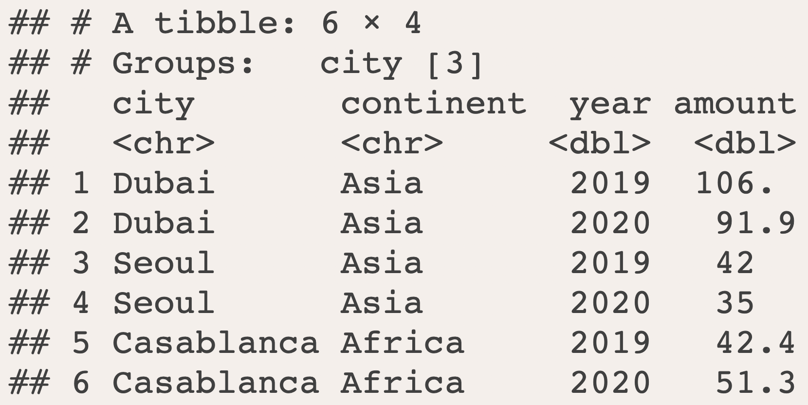
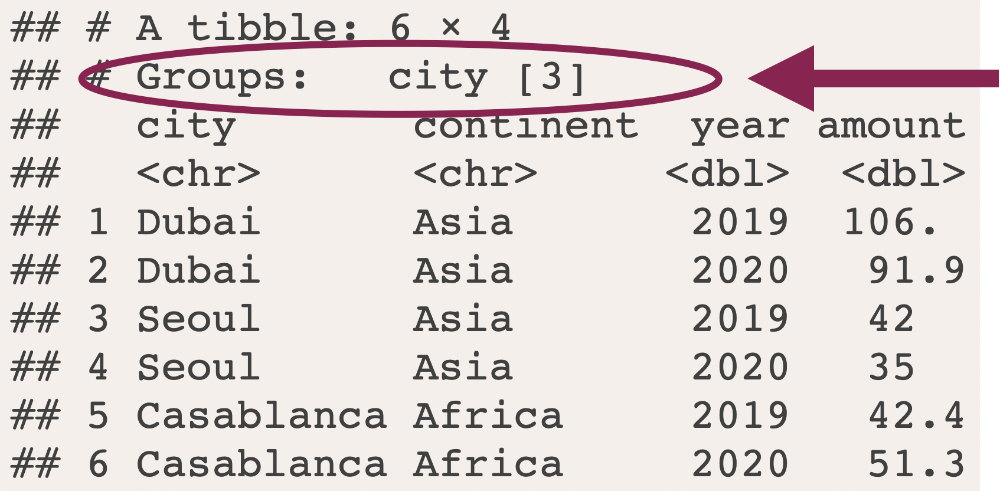

class: title-slide

```{r setup, include=FALSE}
options(htmltools.dir.version = FALSE, dplyr.summarise.inform = FALSE)

hook_source <- knitr::knit_hooks$get('source')
knitr::knit_hooks$set(source = function(x, options) {
  x <- stringr::str_replace(x, "^[[:blank:]]?([^*].+?)[[:blank:]]*#<<[[:blank:]]*$", "*\\1")
  hook_source(x, options)
})

library(tidyverse)
library(babynames)
library(flair)

pollution <- read_csv("data/session05/pollution.csv")
```

# `r rmarkdown::metadata$title`

### `r rmarkdown::metadata$subtitle`

<div class="title-footer">
  
  <div> `r rmarkdown::metadata$author` • `r rmarkdown::metadata$date`</div>
</div>


```{r xaringanExtra, echo=FALSE}
xaringanExtra::use_xaringan_extra(c("tile_view", "panelset", "share_again"))
xaringanExtra::use_clipboard(selector = "pre > code.r, pre > code.md")

if (!is.null(rmarkdown::metadata$shortlink)) {
  shortlink <- rmarkdown::metadata$shortlink
  if (is.character(shortlink)) {
    shortlink <- list(url = shortlink)
  }
  stopifnot(!is.null(shortlink$url))
  
  if (is.null(shortlink$text) || !nzchar(shortlink$text)) {
    shortlink$text <- basename(shortlink$url)
  }
  
  xaringanExtra::use_banner(
    bottom_left = htmltools::tags$a(href = shortlink$url, shortlink$text),
    exclude = "title-slide"
  )
}
```

---
class: speaker-slide

# `r rmarkdown::metadata$author`

<!-- You can copy the image link address from your github profile to use as the src link below --> 


.speaker-links[
[`r fontawesome::fa("github")` skaltman](https://github.com/skaltman)]

---
# Thank you

These slides are adapted from a presentation created by Garrett Grolemund. Thanks 
Garrett!

---
class: middle

# Agenda

1. Summarize data
1. Summary functions
1. Group values together
1. Mini project `r emo::ji("book")`


---
class: middle chapter-slide red

.big-white-number[1.]

# Summarize

---
background-image: url(images/session05/names.jpg)
background-size: cover
class: bottom, left

.big-text.white[Baby names]

---

# `babynames`

```{r eval=TRUE}
library(babynames)
head(babynames)
```

???

The `babynames()` dataset, from the babynames package, includes US baby name data from the SSA. Each row represents a name, sex, year combination, and provides the number of babies and proportion of babies with that name. Only names with at least five uses are included.

---
class: left, middle

.medium-text[What's the total number of babies in `babynames`?]

---
class: center, middle


---
class: center, middle


---
class: center, middle


---

# Total number of babies in `babynames`

```{r eval=FALSE}
babynames %>% 
  summarize(______________) #<<
```

---
# Total number of babies in `babynames`

```{r first-summarize, eval=FALSE}
babynames %>% 
  summarize(total = sum(n)) #<<
```

--

```{r first-summarize-out, ref.label="first-summarize", echo=FALSE}
```

???
`summarize()` collapses a column of information into a single row. In this case, `summarize()` takes the `n` column, sums all the numbers in that column, and returns it as the column `total`

---
# Max number of babies with a name

```{r max, eval=FALSE}
babynames %>% 
  summarize(max = max(n))
```

--

```{r max-out, ref.label="max", echo=FALSE}
```

???
We can use other functions like `max()` and `min()` to find the minimum and maximum numbers that occur in `n`. 

---
class: your-turn

# Your Turn 1

Complete the code to extract rows where `name == [your name]`. Then, use `summarize()`, `sum()`, and `min()` to find:

1. The total number of children with your name.
1. The first year your name appeared in the data.

(If you don't find your name in the data, try one of these names, which have potentially surprising results: Khaleesi, Anakin)

```{r echo = FALSE}
countdown::countdown(minutes = 3)
```

---
class: your-turn

# Your Turn 1 - Solution

```{r sara, eval=FALSE}
babynames %>% 
  filter(name == "Sara") %>% 
  summarize(
    total = sum(n),
    first = min(year)
  )
```

--

```{r sara-out, ref.label="sara", echo=FALSE}
```

---
class: middle chapter-slide blue

.big-white-number[2.]

# Summary functions

---

# Summary functions

```{r sum, include=FALSE, eval=FALSE}
babynames %>% 
  summarize(total = sum(n)) 
```

```{r echo=FALSE}
decorate_chunk("sum", eval = FALSE) %>%
  flair_rx("sum\\(n\\)")
```

```{r my-name-sum, include=FALSE, eval=FALSE}
babynames %>% 
  filter(name == "Sara") %>% 
  summarize(
    total = sum(n),
    first = min(year)
  )
```

```{r echo=FALSE}
decorate_chunk("my-name-sum", eval = FALSE) %>%
  flair_rx("sum\\(n\\)") %>%
  flair_rx("min\\(year\\)")
```

???
we've already seen a couple summary functions, including sum and min

---

# Summary functions

.pull-left[
### `r emo::ji("check")` Take a vector as input
### `r emo::ji("check")` Return a single value as output
]

.pull-right[

]

???
a summary function is just a function that takes a vector as input and returns a 
single value

---

.left-column1[
.medium-text[Common summary functions]
]

.right-column1[
.spaced[

| Function            | Description        |
|:--------------------|:-------------------|
| `n()`               | # of rows          |
| `n_distinct()`      | # of unique values |
| `sum()`             | Sum                |
| `mean()`            | Mean               |
| `median()`          | Median             |
| `min()` / `max()`   | Min/max value      |
| `first()`           | First value        | 
]
]

???
there are many useful summary functions, including ones you've already seen like
sum() and min(). this table is here for your reference, but we'll go over a couple of these functions in a second

---
background-image: url(images/session05/summary-functions.png)
background-size: contain
background-position: right

???
These are also all on your dplyr cheatsheet

---
# `n()`

Find the number of rows 

--

```{r n, eval=FALSE}
babynames %>% 
  summarize(n_rows = n()) #<<
```

--

```{r n-out, ref.label="n", echo=FALSE}
```

---
# `n_distinct()`

Find the number of distinct values in a column

--

```{r n_distinct, eval=FALSE}
babynames %>% 
  summarize(
    n_rows = n(),
    n_names = n_distinct(name) #<<
  )
```

--

```{r n_distinct-out, ref.label="n_distinct", echo=FALSE}
```

---
# What are the most popular names?

--

A name is popular if a large number of children have the name when you sum across years

--

```{r}
babynames %>% 
  filter(name == "Sara") %>% 
  summarize(total = sum(n))
```

???
now, let's go back to babynames

---
class: middle, left

.medium-text[What if we want to do this for every name?]

???
We're going to need to group cases together by name. Before we tackle this task, 
we'll look at groups with a simpler data set. 

---
class: middle chapter-slide green

.big-white-number[2.]

# Group by

---
background-image: url(images/session05/pollution-scene.jpg)
background-size: cover
class: bottom, left

.big-text.white[Pollution]
---
# `pollution`

```{r}
pollution
```

???
small dataset included in your rmarkdown file for this session
represents air pollution data for three cities in 2019 and 2020.

---
# `pollution`

```{r}
pollution %>% 
  summarize(median = median(amount), n = n())
```
???

We already know how to summarize the entire data set to find, for example, the median amount of pollution across all cities and years. 

---
# `pollution`


???
When we summarize, we're taking the entire data set and collapsing it into a single row. 
But what if, instead of the median pollution for the entire data set, we wanted to find
the average pollution for each city?

---
# Group and summarize


???
We want to _group by_ the name of the city, and calculate the average `amount` 
for each of these groups, generating three different numbers. 

---
# 1. `group_by()` 

.pull-left[
```{r eval=FALSE}
pollution %>% 
  group_by(city) #<<
```
]

--

.pull-right-wide[

]

---
# 1. `group_by()` 

.pull-left[
```{r eval=FALSE}
pollution %>% 
  group_by(city) #<<
```
]

.pull-right-wide[

]


???

To do so, we'll first use a function called `group_by()`. When you provide `group_by()`
with a column, it groups the data by that column. 

You can see these groups in the header of the tibble. 

---

# 2. `summarize()`

--

```{r pollution-group-summarize, eval=FALSE}
pollution %>% 
  group_by(city) %>% 
  summarize(median = median(amount), n = n()) #<<
```

--

```{r pollution-group-summarize-out, ref.label="pollution-group-summarize", echo=FALSE}
```


???
Our next step is `summarize()`. When applied to a grouped tibble, `summarize()` will summarize each of the groups in turn. 

Now, we have three rows, each summarizing the mean amount of pollution in a single city. We've collapsed the two rows
for each city into a single row for each city. 
---


---


---
class: your-turn

# Your Turn 2

Use `group_by()` and `summarize()` to find the maximum and mean reported amount of pollution for each continent. 

```{r echo = FALSE}
countdown::countdown(minutes = 3)
```

---
class: your-turn

# Your Turn 2 - Solution

```{r}
pollution %>% 
  group_by(continent) %>% 
  summarize(max = max(amount), mean = mean(amount))
```

---

# Group by multiple columns

```{r}
pollution %>% 
  group_by(continent, year) %>% #<<
  summarize(median = mean(amount))
```

???
We can also group by multiple columns by adding additional columns to `group_by()`. Here, we find the median amount of pollution for each continent and year combination. 

---

# `summarize()` removes a grouping variable

```{r summarize-message, eval=FALSE}
pollution %>% 
  group_by(continent, year) %>% 
  summarize(median = mean(amount))
```

--


???
`summarize()` removes the last grouping variable. Our data is still grouped by `continent`.

---

# ...and it tells you what it's doing

```{r echo=FALSE}
options(dplyr.summarise.inform = TRUE)
```

```{r summarize-message-out, ref.label="summarize-message"}
```

---

# Some dplyr functions respect groups

```{r echo=FALSE}
options(dplyr.summarise.inform = FALSE)
```

```{r grouped-filter, eval=FALSE}
pollution %>% 
  group_by(continent, year) %>% 
  summarize(median = mean(amount)) %>% 
  filter(median == max(median))
```

--

```{r echo=FALSE}
pollution %>% 
  group_by(continent, year) %>% 
  summarize(median = mean(amount)) %>% 
  ungroup() %>% 
  filter(median == max(median))
```
--

.emphasis[But this isn't what happens!]

---

# Some dplyr functions respect groups

```{r eval=FALSE}
pollution %>% 
  group_by(continent, year) %>% 
  summarize(median = mean(amount)) %>% 
  filter(median == max(median))
```

--

```{r grouped-filter-out, ref.label="grouped-filter", echo=FALSE}
```

???
After `summarize()`, the data is still grouped by `continent`, so we get __one row per continent__. 

This is important to realize because some dplyr verbs work differently with grouped data. For example, what if we filtered at this point, when the data is still grouped by continent? 

Instead of getting one row, which contains the maximum median value, we get one row per each continent. 

But what if we just want to find the *one* city with the highest median?

---

# Undoing groups

```{r ungroup, eval=FALSE}
pollution %>% 
  group_by(continent, year) %>% 
  summarize(median = mean(amount)) %>% 
  ungroup() %>% #<<
  filter(median == max(median))
```

--

```{r ungroup-out, ref.label="ungroup", echo=FALSE}
```

???
Do to so, we'll need to `ungroup()` before filtering. 
`ungroup()` removes all groups from the table. 

---

# Recap

--

`r emo::ji("heavy_check_mark")` `group_by()` groups data

--

`r emo::ji("heavy_check_mark")` `group_by()` + `summarize()` summarizes data by group

--

`r emo::ji("heavy_check_mark")` `summarize()` removes one layer of grouping

--

`r emo::ji("heavy_check_mark")` `ungroup()` removes all groups

???
we're going to return to the babynames data, but first lets recap what we covered

---

# Name popularity (again)

```{r}
babynames %>% 
  filter(name == "Sara", sex == "F") %>% 
  summarize(total = sum(n))
```

--

__"What if we want to do this for every name?"__

---
class: your-turn

# Your Turn 3

Complete the code with `group_by()`, `summarize()`,  and `arrange()` to find the most popular name and sex combinations. Compute popularity as the total number of children with a given name and sex. 

```{r echo = FALSE}
countdown::countdown(minutes = 3)
```

---
class: your-turn

# Your Turn 3 - Solution

.pull-left-wide[
```{r most-popular, eval=FALSE}
babynames %>% 
  group_by(name, sex) %>% 
  summarize(total = sum(n)) %>% 
  arrange(desc(total))
```
]

--

.pull-right[
```{r most-popular-out, ref.label="most-popular", echo=FALSE}
```
]

---

.pull-left[
```{r names-plot, echo=FALSE}
babynames %>% 
  group_by(name, sex) %>% 
  summarize(total = sum(n)) %>% 
  arrange(desc(total)) %>% 
  ungroup() %>% 
  slice(1:10) %>% 
  ggplot(
    aes(
      fct_reorder(name, total, .desc = TRUE), 
      total, 
      fill = sex
    )
  ) +
  geom_col() +
  labs(x = "Name", y = "Total")
```
]

.pull-right[
.medium-text[James and John are the most popular, historically]
]

---

# Code for previous plot

```{r names-plot-out, ref.label="names-plot", eval=FALSE}
```

---

# Group by the variables from your test case

```{r eval=FALSE}
babynames %>% 
  filter(name == "Sara", sex == "F") %>% #<<
  summarize(total = sum(n))
```

--

```{r eval=FALSE}
babynames %>% 
  group_by(name, sex) %>% #<<
  summarize(total = sum(n))
```

---
class: your-turn

# Your Turn 4

Use `group_by()` to calculate the total number of children born for every year. 

Plot the results as a line graph: total vs. year. 

```{r echo = FALSE}
countdown::countdown(minutes = 3)
```

---
class: your-turn

# Your Turn 4 - Solution

.pull-left[
```{r babynames-total, eval=FALSE}
babynames %>% 
  group_by(year) %>% 
  summarize(n = sum(n))
```
]

--

.pull-right[
```{r babynames-total-out, ref.label="babynames-total", echo=FALSE}
```
]


---
class: your-turn

# Your Turn 4 - Solution

.pull-left[
```{r plot, eval=FALSE}
babynames %>% 
  group_by(year) %>% 
  summarize(n = sum(n)) %>% 
  ggplot(aes(year, n)) +
  geom_line()
```
]

--

.pull-right[
```{r plot-out, ref.label="plot", echo=FALSE}
```
]


---
background-image: url(images/session05/books.jpg)
background-size: cover

# Mini Project - NYT bestsellers

Open `books.Rmd` in Academy. 
 
```{r echo = FALSE}
countdown::countdown(minutes = 30)
```
