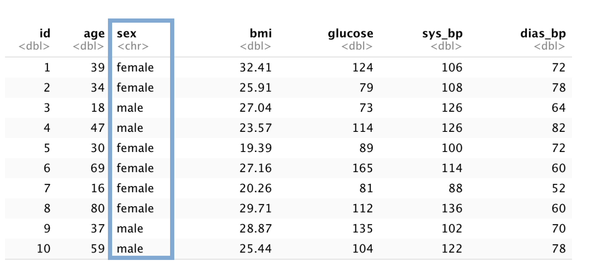
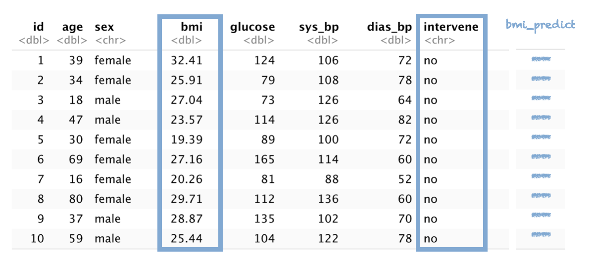
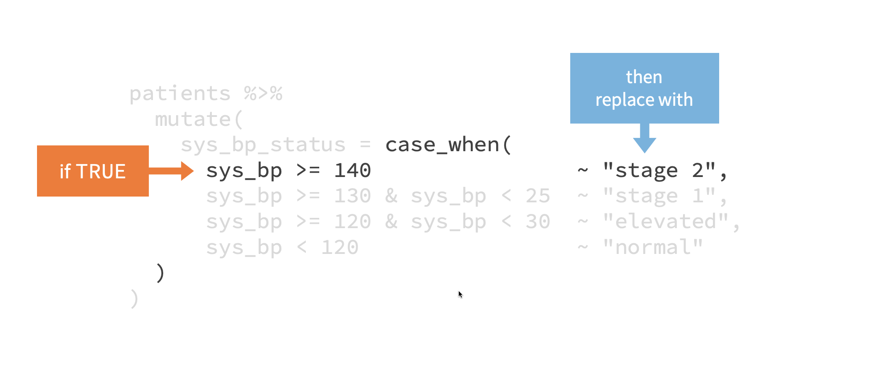

class: title-slide

```{r setup, include=FALSE}
options(htmltools.dir.version = FALSE)

# Load packages
library(dplyr)
library(readr)
library(countdown)

# Parameters
file_patients <- here::here("slides/data/session06/patients.csv")

# Load patients dataset
patients <- read_csv(file_patients)
```

# `r rmarkdown::metadata$title`

### `r rmarkdown::metadata$subtitle`

<div class="title-footer">
  
  <div> `r rmarkdown::metadata$author` • `r rmarkdown::metadata$date`</div>
</div>

```{r xaringanExtra, echo=FALSE}
xaringanExtra::use_xaringan_extra(c("tile_view", "panelset"))
xaringanExtra::use_clipboard(selector = "pre > code.r, pre > code.md")
if (!is.null(rmarkdown::metadata$shortlink)) {
  shortlink <- rmarkdown::metadata$shortlink
  stopifnot(!is.null(shortlink$url))
  
  if (is.null(shortlink$text) || !nzchar(shortlink$text)) {
    shortlink$text <- basename(shortlink$url)
  }
  
  htmltools::HTML(sprintf(
    '<script>document.addEventListener("DOMContentLoaded", function() {
  document
    .querySelectorAll(".remark-slides-area .remark-slide-content")
    .forEach(function(el) {
      const link = document.createElement("a")
      link.classList = "footer-link"
      link.href = "%s"
      link.innerText = "%s"
      el.appendChild(link)
    })
  })</script>',
    shortlink$url,
    shortlink$text
  ))
}
```

???

Welcome to today's session on recoding variables with `if_else()` and `case_when()`, two functions from the dplyr package.

---
class: speaker-slide

# `r rmarkdown::metadata$author`


.speaker-links[
[`r fontawesome::fa("github")` deirdrefrancks](https://github.com/deirdrefrancks)    
[`r fontawesome::fa("twitter")` deirdrefrancks](https://twitter.com/deirdrefrancks) 
]

---

# Thank you

These slides were adapted from materials written by Desirée De Leon. 
Thanks, Desirée!

---
class: middle

# Agenda

1. Review `mutate()`
1. Recode with `if_else()`
1. Recode with `case_when()`
1. Work time: Milestone recreation

???

Here's our agenda for this session. You’ve previously learned how to create and modify variables with `mutate()`. In this lesson, you’ll extend this skill by learning several new functions to use inside of `mutate()` to recode a variable based on its existing values.

We'll practice:

* Recoding data using two logical conditions with `if_else()`
* Recoding a variable using multiple conditions with `case_when()`

By the end of this lesson, you should be able to complete your milestone recreation using the hotels dataset. 

---

class: middle chapter-slide blue

.big-white-number[1.]

# Review `mutate()`

---

# `patients` dataset

```{r patients}
patients
```

???

Today we'll work with the `patients` dataset. We have information about age, sex, body mass index (BMI), fasting blood glucose level (mg/dL), and systolic and diastolic blood pressure (mmHg) for 30 patients. 

---
class: your-turn

# Review `mutate()`

1. Navigate to **conf2022.rstudioacademy.com**
1. Open the **Conf Session 6 - Recode** milestone
1. Complete the **Mutate Review** activity

```{r echo = FALSE}
countdown::countdown(minutes = 4)
```

???

We'll start by reviewing the `mutate()` function.

---
class: your-turn

# Review `mutate()`

```{r}
patients %>% 
  mutate(
    pulse_pressure = sys_bp - dias_bp
  )
```

???

Take a look at the solution to the `mutate()` activity and see how it compares to yours.

---
class: middle chapter-slide blue

.big-white-number[2.]

# Recode with `if_else()`

---


???

Imagine we are tasked with preparing the patient data for use in a program that only accepts the variable `sex` when formatted as 0s (for male) or 1s (for female). We can complete this task by using `if_else()` to recode the variable `sex`.

---

# Recoding with `if_else()`

```{r eval = FALSE}
patients %>% 
  mutate(
    sex_recode = if_else(____, true = ____, false = ____)
  )
```


???

Parts of this code should look familiar to you, since we just practiced using `mutate()` to add columns to a dataset. Here, we'll use `if_else()` inside of `mutate()` to add a column called `sex_recode`.

`if_else()` takes three arguments to recode its values.

---

# Recoding with `if_else()`

```{r eval = FALSE}
patients %>% 
  mutate(
    sex_recode = if_else(sex == "male", true = ____, false = ____)
  )
```

???
 
The first thing to add is the logical condition. This argument is called `condition`, but you'll rarely see that argument spelled out, so I've removed it here.

---

# Recoding with `if_else()`

```{r eval = FALSE}
patients %>% 
  mutate(
    sex_recode = if_else(sex == "male", true = 0, false = ____)
  )
```

???
 
Next we'll add the value our variable should take if the condition is `true`.

---

# Recoding with `if_else()`

```{r}
patients %>% 
  mutate(
    sex_recode = if_else(sex == "male", true = 0, false = 1)
  )
```

???

Finally we'll add the value the variable should take if the condition is `false`. I've evaluated this code and you can see the table output below. Notice that the call to `mutate()` did not alter the `sex` column; it created a new column called `sex_recode`.

---
class: your-turn

# Your turn 1

Add a new variable to `patients` that recodes the values of systolic blood pressure into the two categories defined below: `"normal"` and `"high"`. 

Name this new variable `sys_status`. You do not need to save the resulting tibble.

| `sys_bp`          | `sys_status` |
|:------------------|:-------------|
| Less than 130 mmHg| normal       |
| 130 mmHg or above | high         |

```{r echo = FALSE}
countdown::countdown(minutes = 4)
```

???

Let's do some more practice with `if_else()`. Complete the code in the chunk labeled  `your-turn-1`.

---
class: your-turn

# Your turn 1

```{r your-turn-1-solution}
patients %>% 
  mutate(
    sys_status = if_else(sys_bp >= 130, "high", "normal")
  )
```

???

You'll often see `if_else()` written without any arguments spelled out. Any questions?

---

# Debug `if_else()`

```{r debug-1, error = TRUE}
patients %>%
  mutate(
    sex_recode = if_else(sex == "male", 0, "f")
  )
```

???

Any ideas about what's gone wrong here?

---

# Complex logical conditions

1. Age 40 or older
1. Blood glucose is 126 mg/dL or greater
1. A BMI of 27 or greater

???

Imagine that we want to identify which patients require medical intervention based on their age, blood glucose level, and BMI. Patients eligible for intervention must meet these three criteria.

So far you have used `if_else()` with basic logical conditions, but you can recode values based on more complex logical tests.

---

# Complex logical conditions

1. Age 40 or older
1. Blood glucose is 126 mg/dL or greater
1. A BMI of 27 or greater

```{r eval = FALSE}
patients %>% 
  mutate(
    intervene = if_else(
      ____ & ____ & ____,
      "yes", 
      "no"
    )
  )
```

???

Here is the outline of an `if_else()` call inside of `mutate()` that we can use to create the variable `intervene` based on the conditions above.

---

# Complex logical conditions

1. **Age 40 or older**
1. Blood glucose is 126 mg/dL or greater
1. A BMI of 27 or greater

```{r eval = FALSE}
patients %>% 
  mutate(
    intervene = if_else(
      age >= 40 & ____ & ____, 
      "yes", 
      "no"
    )
  )
```

???

Let's add the first condition: age 40 or older.

---

# Complex logical conditions

1. **Age 40 or older**
1. **Blood glucose is 126 mg/dL or greater**
1. A BMI of 27 or greater

```{r eval = FALSE}
patients %>% 
  mutate(
    intervene = if_else(
      age >= 40 & glucose >= 126 & ____, 
      "yes", 
      "no"
    )
  )
```

???

...and blood glucose greater than or equal to 126.

---

# Complex logical conditions

1. **Age 40 or older**
1. **Blood glucose is 126 mg/dL or greater**
1. **A BMI of 27 or greater**

```{r eval = FALSE}
patients %>% 
  mutate(
    intervene = if_else(
      age >= 40 & glucose >= 126 & bmi >= 27, 
      "yes", 
      "no"
    )
  )
```

???

...and BMI of 27 or greater.

---
# Complex logical conditions

1. **Age 40 or older**
1. **Blood glucose is 126 mg/dL or greater**
1. **A BMI of 27 or greater**

```{r}
patients_interventions <-
  patients %>% 
  mutate(
    intervene = if_else(
      age >= 40 & glucose >= 126 & bmi >= 27, 
      "yes", 
      "no"
    )
  )
```

???

I'll save this as a tbl called `patients_interventions` for us to use next.

---

# Complex TRUE and FALSE conditions



???

Consider the `patients_interventions` dataset we've just created. Imagine that you predict the medical intervention will lower a patient’s BMI by 10% (i.e., `bmi * 0.90`), and you want to add these predicted values as a new variable.

---

class: your-turn

# Your turn 2

Add a new variable to the `patients_interventions` dataset that calculates a 10% reduction in BMI for patients who receive intervention. For all other patients, have this variable display the patient’s current BMI. 

Name the new variable `bmi_predict`. You do not need to save the resulting tibble.

```{r echo = FALSE}
countdown::countdown(minutes = 4)
```

---

class: your-turn

# Your turn 2

```{r your-turn-2-solution}
patients_interventions %>% 
  mutate(
    bmi_predict = if_else(
      intervene == "yes", 
      bmi * 0.90, 
      bmi
    )
  )
```

---

class: inverse

# Takeaway

Use this template to recode values with `if_else()`

```{r if_else-syntax, eval = FALSE}
if_else(<LOGICAL TEST>, <DO THIS IF TRUE>, <DO THIS IF FALSE>)
```

???

* `if_else()` is used with a logical test to recode a variable's values in one of two ways. 
* The logical tests can be as complex as needed.
* The `TRUE` and `FALSE` conditions can incorporate R functions and objects.
* When using `if_else()` to recode a column in a table, it must be used within a `mutate()` call.

---
class: middle chapter-slide blue

.big-white-number[3.]

# Recode with `case_when()`

---
# Multiple conditions

| Blood pressure category         | Systolic Blood Pressure (mmHg)    |
|:--------------------------------|:----------------------------------|
| Normal                          | Below 120                         |
| Elevated                        | 120 to < 130                      |
| Stage 1 Hypertension            | 130 to < 140                      |
| Stage 2 Hypertension            | 140 and above                     |


???

We previously recoded systolic blood pressure of `patients` into 2 weight categories: "high" and "normal", but official CDC guidelines specify 4 categories.

---
# Multiple conditions with `if_else()`?

| Blood pressure category         | Systolic Blood Pressure (mmHg)    |
|:--------------------------------|:----------------------------------|
| Normal                          | Below 120                         |
| Elevated                        | 120 to < 130                      |
| Stage 1 Hypertension            | 130 to < 140                      |
| Stage 2 Hypertension            | 140 and above                     |


```{r echo = FALSE}
countdown::countdown(minutes = 0, seconds = 30)
```

???

Can we use `if_else()` to recode a variable under more than two conditions? Discuss with your group.

---

# Multiple conditions with `if_else()`?

```{r}
patients %>% 
  mutate(
    sys_bp_status = if_else(
      sys_bp < 120, 
      "normal",
      if_else(
        sys_bp < 130, 
        "elevated", 
        if_else(
          sys_bp < 140, 
          "stage 1",
          "stage 2"
        )
      )
    )
  )
```

???

We could, but it would require nested `if_else()` calls, which can get pretty confusing.

---

# Multiple conditions with `case_when()`

```{r eval = FALSE}
patients %>% 
  mutate(
    sys_bp_status = case_when(
      ____ ~ ____, 
      ____ ~ ____, 
      ____ ~ ____, 
      ____ ~ ____, 
    )
  )
```

???

A better option is to use `case_when()`.

---
# Multiple conditions with `case_when()`

```{r}
patients %>% 
  mutate(
    sys_bp_status = case_when(
      sys_bp >= 140           ~ "stage 2",
      sys_bp >= 130 & sys_bp  ~ "stage 1",
      sys_bp >= 120 & sys_bp  ~ "elevated",
      sys_bp < 120            ~ "normal"
    )
  )
```

???

Here's what that recode operation looks like with `case_when()`.

---

# Using `case_when()`



???

`case_when()` has an unusual syntax. The arguments to this function consist of a series of **formulas**, which are written using a tilde (`~`).

* The **left hand side** of each formula is a logical test, e.g. `sys_bp < 120`.  
* The **right hand side** indicates the replacement value when the logical test is `TRUE`.

---
class: your-turn

# Your turn 3

Add a new variable to `patients` that recodes the values of `glucose` into the three categories defined below: `"non-diabetic"`, `"pre-diabetic"`, and `"diabetic"`.

Name this new variable `diabetes_status`. Save the new tibble as an object called `patients_2`.

| Diabetes status | Fasting blood glucose |
|:----------------|:----------------------|
| Non-diabetic    | below 100 mg/dL       |
| Pre-diabetic    | 100 - 125 mg/dL       |
| Diabetic        | 126 mg/dL or above    |

```{r echo = FALSE}
countdown::countdown(minutes = 4)
```

???

Let's practice using `case_when()` with the `patients` dataset. Fasting blood glucose levels can be used to test for diabetes. This table summarizes the relevant cutoffs. Use the table to recode the values of `glucose`.

---
class: your-turn

# Your turn 3

```{r your-turn-3-solution, eval = TRUE}
patients_2 <-
  patients %>% 
  mutate(
    diabetes_status = case_when(
      glucose < 100                   ~ "non-diabetic",
      glucose >= 100 & glucose < 126  ~ "pre-diabetic",
      glucose >= 126                  ~ "diabetic"
    )
  )
```

???

`case_when()` syntax can be a bit tricky to remember at first, but with more practice it will become second nature.

---

# Debug `case_when()`

```{r debug-cw-1, error = TRUE}
patients %>% 
  mutate(
    sys_bp_status = case_when(
      sys_bp >= 140           = "stage 2",
      sys_bp >= 130 & sys_bp  = "stage 1",
      sys_bp >= 120 & sys_bp  = "elevated",
      sys_bp < 120            = "normal"
    )
  )
```

???

The code intends to recode `sys_bp` into four categories, as we did before. What has gone wrong?

---

# Catch-all conditions

| Diabetes status            | Follow up schedule (in months) |
|:---------------------------|:-------------------------------|
| Diabetic and BMI >= 30     | 1                              |
| Pre-diabetic and BMI >= 30 | 1.5                            |
| All others                 | 2                              |

???

In some cases, you may need a "catch all" condition with `case_when()`. For example, imagine patients are recommended to schedule a follow up visit based on a combination of diabetes and BMI.

---

# Catch-all conditions

```{r catch-all, eval = FALSE}
case_when(
  <LOGICAL TEST> ~ <DO THIS IF TRUE>, 
  <LOGICAL TEST> ~ <DO THIS IF TRUE>,
  TRUE ~ <DO THIS>
)
```

???

When writing the logical test for everyone or everything else, replace the left hand side of the `case_when()` formula with `TRUE`, like this.

---
class: your-turn 

# Your turn 4

Add a new variable to `patients_2` that displays the recommended number of months until follow up for each patient. 

Name this new variable `followup`. You do not need to save the resulting tibble.

| Diabetes status            | Follow up schedule (in months) |
|:---------------------------|:-------------------------------|
| Diabetic and BMI >= 30     | 1                              |
| Pre-diabetic and BMI >= 30 | 1.5                            |
| All others                 | 2                              |

```{r echo = FALSE}
countdown::countdown(minutes = 4)
```

???

Practice using a catch-all condition.

---
class: your-turn

# Your turn 4

```{r your-turn-4-solution, eval = TRUE}
patients_2 %>% 
  mutate(
     followup = case_when(
       diabetes_status == "diabetic" & bmi >= 30 ~ 1, 
       diabetes_status == "pre-diabetic" & bmi >= 30 ~ 1.5,
       TRUE ~ 2,
    )
  )
```

---

# Recoding to `NA`

```{r na-error, error = TRUE}
patients_2 %>% 
  mutate(
     followup = case_when(
       diabetes_status == "diabetic" ~ 1, 
       diabetes_status == "pre-diabetic" ~ 1.5,
       TRUE ~ NA,
    )
  )
```


???

You learn that a new policy is in place and only diabetic and pre-diabetic patients will have follow up visits, regardless of BMI. Follow up visits for all other patients have been cancelled and should be coded as `NA` instead. The variable `followup` needs to be changed accordingly. 

When you want to recode some values to `NA`, filling in the right hand side of the `case_when()` formula with `NA` will usually *NOT* work.

The error message gives us a hint why. All right hand side values need to be the same type of data. `NA` is a `logical`, but `followup` needs to be a double.

---

# Recoding to `NA`

|`NA` type          |For use with                     |
|:------------------|:--------------------------------|
| `NA_character_`   | character values, i.e. `"a"`    |
| `NA_real_`        | doubles, i.e. `1`               |
| `NA_integer_`     | integers, i.e. `1L`             |
| `NA_complex_`     | complex numbers, i.e. `1+1i`    |
| `NA`              | logicals, i.e. `TRUE` or `FALSE`|

???

We must use a special type of `NA` value to match the other data type for the column we are creating.

---
class: your-turn

# Your turn 5

Add a new variable to `patients_2` that displays the recommended number of months until follow up for each patient. Use the appropriate missing value in your solution (one of `NA_character_`, `NA_real_`, `NA_integer_`, `NA_complex`, or `NA`).

Name this new variable `followup`. You do not need to save the resulting tibble.

| Diabetes status            | Follow up schedule (in months) |
|:---------------------------|:-------------------------------|
| Diabetic and BMI >= 30     | 1                              |
| Pre-diabetic and BMI >= 30 | 1.5                            |
| All others                 | NA                             |

```{r echo = FALSE}
countdown::countdown(minutes = 4)
```

???

Fix the code from earlier using the appropriate `NA` value.

---
class: your-turn

# Your turn 5

```{r your-turn-5-solution}
patients_2 %>% 
  mutate(
    followup = case_when(
      diabetes_status == "diabetic" ~ 1, 
      diabetes_status == "pre-diabetic" ~ 1.5,
      TRUE ~ NA_real_,
    )
  )
```

???
---
class: inverse

# Takeaway

Use this template to recode values with `case_when()`.

```{r case_when-syntax, eval = FALSE}
case_when(
  <LOGICAL TEST> ~ <DO THIS IF TRUE>,
  <LOGICAL TEST> ~ <DO THIS IF TRUE>,
  TRUE           ~ <DO THIS>
)
```

???

* `case_when()` is useful when you want to recode a variable's values using more than logical tests.  

* To create a "catch all" condition, the last logical test should follow the pattern:
  ```
  TRUE ~ <DO THIS>
  ``` 
* To recode values to `NA`, the type of `NA` should match the data type of the other values in recoded columns, e.g. (`NA_real_`, `NA_integer_`, `NA_complex_`, `NA_character_`)

* When using `case_when()` to recode a column in a table, it must be used within a `mutate()` call. Like `if_else()`, you can also use `case_when()` on standalone vectors. You do not *have* to use it within `mutate()`. 
---
class: middle chapter-slide blue

.big-white-number[4.]

# Conf milestone

---
class: your-turn

# Your turn: `Conf Milestone`

.center[
```{r conf-milestone, echo = FALSE, out.width = "80%", fig.align = "center"}

```
]


