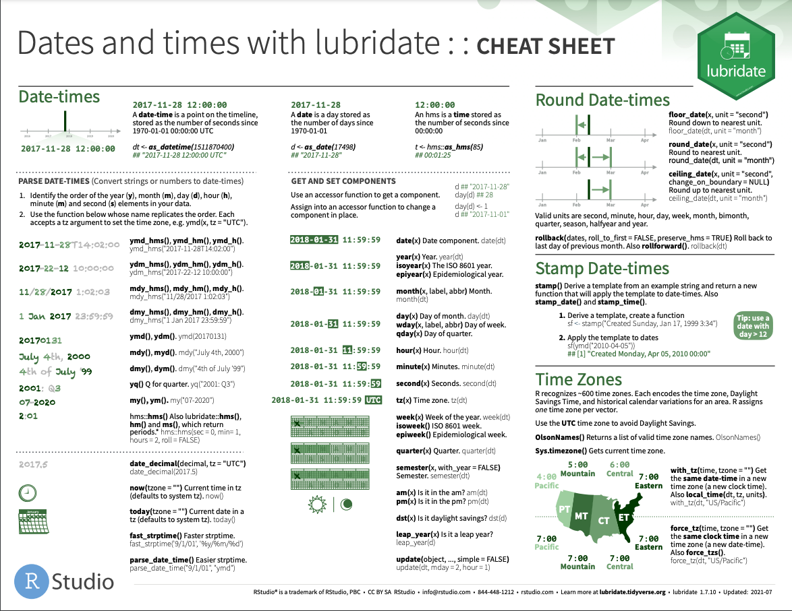

class: title-slide

```{r setup, include=FALSE, warning=FALSE}
options(htmltools.dir.version = FALSE)

library(lubridate);  library(dplyr);

# bike_traffic <- read.csv("https://raw.githubusercontent.com/rfordatascience/tidytuesday/master/data/2019/2019-04-02/bike_traffic.csv")
# 
# bike_traffic <- 
#   bike_traffic %>%
#   filter(crossing == "Burke Gilman Trail") %>%
#   drop_na() %>%
#   as_tibble()
# 
# saveRDS(bike_traffic, './data/session07/bike_traffic.rds')

bike_traffic = readRDS('./data/session07/bike_traffic.rds')

```

# `r rmarkdown::metadata$title`

### `r rmarkdown::metadata$subtitle`

<!-- .top-right{ -->
<!--   position: absolute; -->
<!--   top: 100px; -->
<!--   right: 200px; -->
<!-- } -->
<!-- would use class = in the html tag if pulling from file -->


<div class="title-footer">
  
  <div> `r rmarkdown::metadata$author` • `r rmarkdown::metadata$date`</div>
</div>

```{r xaringanExtra, echo=FALSE}
xaringanExtra::use_xaringan_extra(c("tile_view", "panelset", "share_again"))
xaringanExtra::use_clipboard(selector = "pre > code.r, pre > code.md")

if (!is.null(rmarkdown::metadata$shortlink)) {
  shortlink <- rmarkdown::metadata$shortlink
  if (is.character(shortlink)) {
    shortlink <- list(url = shortlink)
  }
  stopifnot(!is.null(shortlink$url))
  
  if (is.null(shortlink$text) || !nzchar(shortlink$text)) {
    shortlink$text <- basename(shortlink$url)
  }
  
  xaringanExtra::use_banner(
    bottom_left = htmltools::tags$a(href = shortlink$url, shortlink$text),
    exclude = "title-slide"
  )
}
```

---
class: speaker-slide

# `r rmarkdown::metadata$author`


.speaker-links[
[`r fontawesome::fa("github")` Laura-Puckett](https://github.com/Laura-Puckett)  
[`r fontawesome::fa("envelope")` laura.puckett@rstudio.com](laura.puckett@rstudio.com)
]

---

class: middle chapter-slide green

.big-white-number[1.]
# Overview of `lubridate`

---
class: top
background-image: url(images/lubridate/date_and_datetime.png)
background-size: cover

???

Lubridate is a package to make it easier to work with dates and datetimes. These are two standard formats for storing time-related information. A date is what is sounds like - the information for a date, so the year, month, and day. 

A datetime stores all of that as well as hours, minutes, and seconds.

Lubridate contains a lot of cool features to make it easier to work with dates and datetimes. s
---

class: top
background-image: url(images/lubridate/make_dates_1.png)
background-size: cover

# Creating Dates and Datetimes

???
When working with time-related information, often the first step is to get your data into a date or datetime format. 

When reading you data into R, it may be expressed in a variety of formats. The lubridate functions are built to make this transformation as intuitive and flexible as possible. 

Here we have four different format to express the same date. A lubridate function called `ymd` for year/month/day can handle all of these different formats and will output the Date object shown on the right. 
---

class: top
background-image: url(images/lubridate/make_dates_2.png)
background-size: cover

# Creating Dates and Datetimes

???
There are a number of functions that lubridate includes for creating a date or datetime from almost any format. Many of them are listed in this table.  
---

class: top
background-image: url(images/lubridate/diagram_1.png)
background-size: cover
# Extract Information

???
Once we have our data in a date or datetime format, we are able to easily access all of the components used to build the object, wuch as the year, month, day, etc. 

---

class: top
background-image: url(images/lubridate/diagram_2.png)
background-size: cover
# Extract Information

???
And, we can even extract additional information such as the quarter, week or day of the year of weekday. 
---
class: top
# Other tasks with lubridate

???
Some additional tasks that can be completed using lubridate functions are to

do math with dates and datetimes, meaning we can add and subtact time-related information

convert between different time zones

account for leap time

round times to the nearest week, for example, and

work with intervals of time

--

- math with time

--

- time zones

--

- leap seconds, leap years

--

- rounding times

--

- time intervals

---

class: middle chapter-slide green

.big-white-number[2.] 
# Example

???
Now let's go through a quick example of some of these functions. 
---
# Bike Traffic Dataset
```{r}
bike_traffic
```

???
Here is a dataset of bike traffic that we just loaded into R. The date column is stored as a factor with hours listed in AM and PM and is not currently in the standardized datetime format. 
---

# Get into a `datetime` format

```{r, include = TRUE, eval = FALSE, warning = FALSE}
bike_traffic <- 
  bike_traffic %>%
  mutate(timestamp = `mdy_hms`(date,
                             tz = "US/Pacific"))
```

--

```{r, echo = FALSE, eval = TRUE, warning = FALSE}
bike_traffic <- 
  bike_traffic %>%
  mutate(timestamp = mdy_hms(date,
                             tz = "US/Pacific")) %>%
  select(timestamp, direction, crossing, bike_count)

print(bike_traffic, n = 7)
```

???

We can use a lubridate function to turn this column into a datetime.
---

# Get into a `date` format

```{r, include = TRUE, eval = FALSE}
labor_day <- `ymd`("2015-09-07")
```

--

```{r, echo = FALSE, eval = TRUE}
labor_day <- ymd("2015-09-07")
labor_day
```

???
Suppose we are interested in the bike traffic around labor day. We can start by creating a date object for our date of interest. 

---
class:top

# Find the day of the week
```{r month_1, eval = FALSE}
wday(labor_date, label = TRUE)
```

--

```{r month, eval = TRUE, echo = FALSE}
wday(labor_day, label = TRUE)
```

???
And we can confirm that the day of week is Monday as expected.
---

class: top
# Manipulate Times

```{r weeks}
labor_day - weeks(1)
```

???
Now we can do math with the date. If we are interested in the bike traffic within a week of labor day, we can easily add or subtract a week from the date.

---
# Time Intervals
```{r interval_highighted, eval = FALSE}
date_interval <- `interval`(labor_day - weeks(1),
                               labor_day + weeks(1))
date_interval
```

--

```{r interval, echo = FALSE, eval = TRUE}
date_interval <- interval(labor_day - weeks(1),
                               labor_day + weeks(1))
date_interval
```

???
Next, we can create an interval that will span from one week before labor day to one week after using lubridate's interval function.
--

```{r filter_interval_highlighted, eval = FALSE}
bike_traffic %>%
  filter(`timestamp %within% date_interval`)
```

???
And finally we can filter our dataset to that time interval using an operator called within. 
---
# Filtered Result
```{r filter_interval, eval = TRUE, echo = FALSE}
bike_traffic %>%
  filter(timestamp %within% date_interval) %>%
  print(n = 13)
```

---
class: middle chapter-slide green

.big-white-number[3.]
# Resources

---
class: top
# Resources

.pull-left[
- [Lubridate Site](https://lubridate.tidyverse.org/)

- [R for Data Science Ch. 16 - Dates and Times](https://r4ds.had.co.nz/dates-and-times.html)
]

.pull-right[
 
]

???
Here are some additional resources for the lubridate package. 
The site includes links to the cheatsheets and some examples. 

Chapter 16 of R for Data Science includes an in-depth description of lubridate's many features. 
---
class: middle chapter-slide green

.big-white-number[4.]
# Exercises

---
class: your-turn

# Your Turn

A. What day of the week was the moon landing (September 7, 1969)?

```{r, eval = FALSE}
ymd(____) %>%
  ____(label = ____)

```

B. How many days ago was the moon landing?

```{r, eval = FALSE}
ymd(____) ____ date(now())

```

