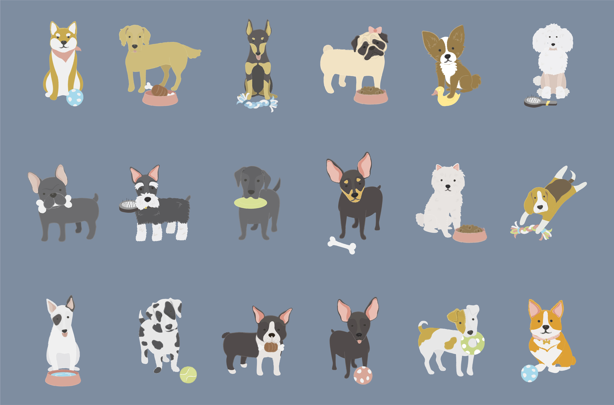
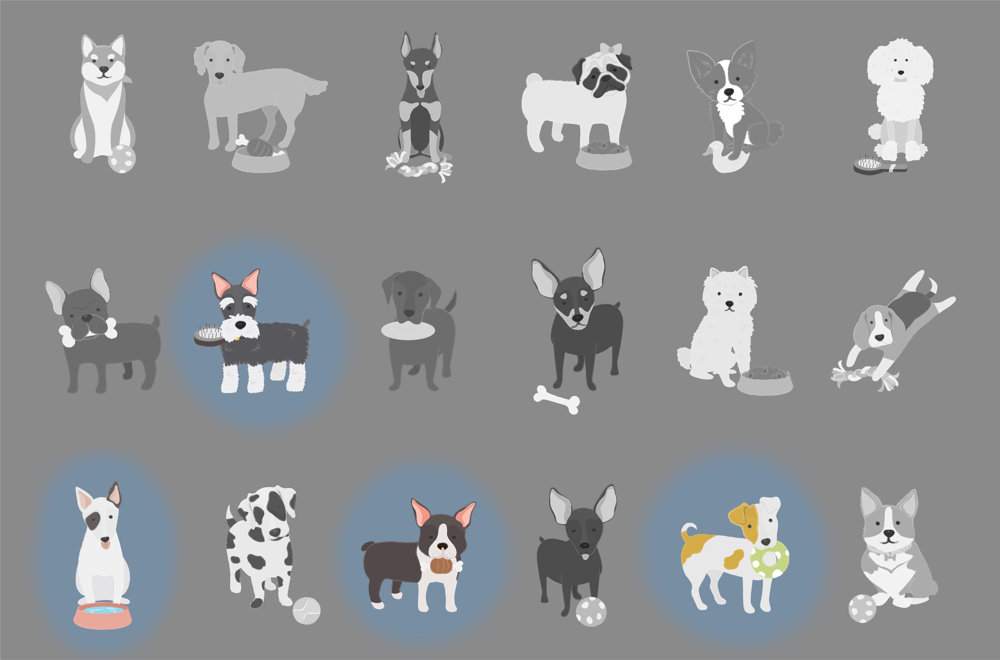

class: title-slide

```{r setup, include=FALSE}
options(htmltools.dir.version = FALSE)
```

# `r rmarkdown::metadata$title`

### `r rmarkdown::metadata$subtitle`

<div class="title-footer">
  
  <div> `r rmarkdown::metadata$author` • `r rmarkdown::metadata$date`</div>
</div>

```{r xaringanExtra, echo=FALSE}
xaringanExtra::use_xaringan_extra(c("tile_view", "panelset", "share_again"))
xaringanExtra::use_clipboard(selector = "pre > code.r, pre > code.md")

if (!is.null(rmarkdown::metadata$shortlink)) {
  shortlink <- rmarkdown::metadata$shortlink
  if (is.character(shortlink)) {
    shortlink <- list(url = shortlink)
  }
  stopifnot(!is.null(shortlink$url))
  
  if (is.null(shortlink$text) || !nzchar(shortlink$text)) {
    shortlink$text <- basename(shortlink$url)
  }
  
  xaringanExtra::use_banner(
    bottom_left = htmltools::tags$a(href = shortlink$url, shortlink$text),
    exclude = "title-slide"
  )
}
```

---

class: speaker-slide

# `r rmarkdown::metadata$author`

<!-- You can copy the image link address from your github profile to use as the src link below --> 


.speaker-links[
[`r fontawesome::fa("github")` stevensmallberg](https://github.com/stevensmallberg)    
[`r fontawesome::fa("twitter")` stevensmallberg](https://twitter.com/stevensmallberg)   
]

---

class: middle

.top-fixed[
# Meet stringr
]

.center[]

???

The stringr package is your tidyverse companion to all things strings.

stringr provides a cohesive set of functions that make working with character data in R as easy as possible. *Most* any task you can think of that involves character data can be accomplished with stringr.

It's part of the core tidyverse, along with packages like dplyr and ggplot2, so stringr functions play really nicely with dplyr functions like `filter()` and `mutate()`.

Let's look at a concrete example.

---

class: middle

# `breed_traits` dataset

```{r, include = FALSE}
# Source
# https://github.com/rfordatascience/tidytuesday/blob/master/data/2022/2022-02-01/readme.md

# Libraries
library(tidyverse)
library(flair)

# Paths
PATH_BREED_TRAITS <-
  "https://raw.githubusercontent.com/rfordatascience/tidytuesday/master/data/2022/2022-02-01/breed_traits.csv"

# Load data
breed_traits <-
  read_csv(PATH_BREED_TRAITS) %>% 
  janitor::clean_names() %>% 
  mutate(breed = str_squish(breed)) %>% 
  select(breed, where(is.numeric)) %>% 
  rename_with(~ str_replace_all(., "with", "w")) %>% 
  rename_with(~ str_remove_all(., "_level")) %>% 
  rename(
    affection = affectionate_w_family,
    good_w_children = good_w_young_children,
    grooming_freq = coat_grooming_frequency,
    openness = openness_to_strangers,
    protectiveness = watchdog_protective_nature,
    stimulation_needs = mental_stimulation_needs
  ) %>% 
  relocate(
    good_w_children,
    good_w_other_dogs,
    grooming_freq,
    .after = last_col()
  )
```

```{r, echo = FALSE}
breed_traits
```

???

The `breed_traits` dataset is a fun dataset that contains information on `r n_distinct(breed_traits$breed)` dog breeds, with scores (on a 1-5 scale) for `r ncol(breed_traits)` traits (e.g. how affectionate the breed is, how much it sheds, how playful it is, etc). This data comes courtesy of the American Kennel Club.

In our analysis, want to compare traits across terrier breeds only, of which there are many types.

---

class: middle

.center[]

???

To make this very clear, we have `r n_distinct(breed_traits$breed)` dog breeds (with 18 very good boys and girls are pictured here as an example)...

---

class: middle

.center[]

???

...and we want to subset the data so that we can continue our analysis on terrier breeds. Note that I don't know how many of the `r n_distinct(breed_traits$breed)` breeds in the dataset have "terrier" as part of their name, but I want to keep them all.

(The four highlighted breeds, from top to bottom, left to right, are Scottish, Bull, Boston, and Russell terriers.)

---

class: middle

.top-fixed[
# Sniffing out terrier breeds
]

```{r}
breed_traits %>% 
  filter(breed == "Yorkshire Terriers")
```

???

When I say "subset", alarm bells are probably going off in your head that we we'll be using the `filter()` function.

Using what we've already know how to do, we can print the `breed_traits` table and scan through the paginated results in RMarkdown to find our first match — Yorkshire terriers.

We'll use the `==` operator to match the string, and get one row in the output.

---

class: middle

.top-fixed[
# Sniffing out terrier breeds
]

```{r filter}
breed_traits %>% 
  filter(breed %in% c("Yorkshire Terriers", "Boston Terriers"))
```

???

And then our second match — Boston terriers.

This time, we'll use the `%in%` operator to match a vector of strings, and get two rows in the output.

You can where this is going...

---

class: middle

# Sniffing out terrier breeds

```{r, include = FALSE}
breed_traits %>% 
  filter(breed %in% c(
    "Yorkshire Terriers",
    "Boston Terriers",
    "West Highland White Terriers",
    "Scottish Terriers",
    "Fox Terriers (Wire)",
    "Soft Coated Wheaten Terriers",
    "Airedale Terriers",
    "Bull Terriers",
    "Russell Terriers",
    "Cairn Terriers",
    "Staffordshire Bull Terriers",
    "American Staffordshire Terriers",
    "Rat Terriers",
    "Border Terriers",
    "Tibetan Terriers",
    "Miniature Bull Terriers",
    "Silky Terriers",
    "Norwich Terriers",
    "Welsh Terriers",
    "Toy Fox Terriers",
    "Parson Russell Terriers",
    "Irish Terriers",
    "Fox Terriers (Smooth)",
    "Black Russian Terriers",
    "American Hairless Terriers",
    "Norfolk Terriers",
    "Manchester Terriers",
    "Kerry Blue Terriers",
    "Australian Terriers",
    "Lakeland Terriers",
    "Bedlington Terriers",
    "Sealyham Terriers",
    "Glen of Imaal Terriers",
    "Dandie Dinmont Terriers",
    "Skye Terriers",
    "Cesky Terriers"
  )
)
```

```{r big-filter-display, include = FALSE, eval = FALSE}
breed_traits %>% 
  filter(breed %in% c(
    "Yorkshire Terriers",
    "Boston Terriers",
    "West Highland White Terriers",
    "Scottish Terriers",
    "Fox Terriers (Wire)",
    ...
  )
)
```

```{r, echo = FALSE}
decorate_chunk("big-filter-display", eval = FALSE) %>% 
  flair_rx("(?<=%)in(?=%)", bold = TRUE) %>% 
  flair_rx('"([:alpha:]|[:space:]|\\(|\\))*"', color = "#dd1144")
```

???

If you think about extending this process to all `r round(nrow(breed_traits), digits = -2)` or so rows, you'll realize that filtering with explicit strings isn't really a scalable solution. Even in this relatively small and tidy dataset, we can see that it becomes tedious and error-prone very quickly.

---

class: middle

# Sniffing out terrier breeds

```{r, echo = FALSE}
decorate_chunk("big-filter-display", eval = FALSE) %>%
  flair_rx("(?<=%)in(?=%)", bold = TRUE) %>% 
  flair_rx('"([:alpha:]|[:space:]|\\(|\\))*"', color = "#dd1144") %>% 
  flair("Terrier", background = "#e2d8d2")
```

???

And you'd be right to intuit that there's a simpler way. All we, the humans, are doing is looking for the sequence "Terrier" in the `breed` column. This is exactly the kind of simple but highly repetitive task that's well-suited to outsource to our computers.

That's where stringr comes in.

---

class: middle

# Filtering with `str_detect()`

```{r}
breed_traits %>% 
  filter(str_detect(breed, "Terrier"))
```

???

The `str_detect()` function searches for the presence of a pattern in a string and returns a logical vector that's `TRUE` if the pattern is detected, or `FALSE` if it's not. That makes it a very powerful function in combination with `filter()`.

In the example code, we keep only the rows where the sequence "Terrier" is found in the `breed` column, and drop the rest.

We can also use `str_detect()` to recode character variables using `mutate()` in combination with the new functions — `if_else()` and `case_when()` — that we learned about today. You could imagine that we might want to create a `breed_family` variable that includes all breeds with "Terrier" in the name, or "Retriever", or "Shepherd", etc.

Let's take a look at a few quicker examples of what stringr can do.

---

class: middle

.top-fixed[
# stringr functions
]

Character manipulation

```{r}
str_sub("Introduction to the tidyverse", 21, 24)
```

???

We can extract (and replace) substrings from a vector using `str_sub()`, in this case by extracting the 21st through 24th characters which form the word "tidy".

---

class: middle

.top-fixed[
# stringr functions
]

Whitespace tools

```{r}
str_trim("   Introduction to the tidyverse          ")
```

???

We can trim whitespace from a string using `str_trim()`, which can be a quick and easy data cleaning step.

---

class: middle

.top-fixed[
# stringr functions
]

Locale-sensitive operations

```{r}
str_to_upper("Introduction to the tidyverse")
```

???

We can turn convert cases with `str_to_upper()` and turn strings into yells.

These functions are called "locale-sensitive operations" because they can follow capitalization and alphabetization rules in different languages.

---

class: middle

.top-fixed[
# stringr functions
]

Pattern matching

```{r, eval = FALSE}
str_view_all("Introduction to the tidyverse", "[aeiou]")
```

```{r, echo = FALSE}
decorate_code("Introduction to the tidyverse", eval = FALSE) %>%
  flair_rx("[aeiou]", background = "#e2d8d2")
```

???

And we can visualize how patterns match to our data with `str_view()` (and `str_view_all()`). In this case, I'm looking to highlight the vowels in my input string, but the patterns you search for can be very flexible and powerful.

You may have noticed an elegant detail: *all* stringr functions start with the prefix "str_". This is especially nice when you're working in RStudio because typing that prefix out will trigger autocomplete and allow you to see all of the functions.

---

class: your-turn

# Your Turn

Use a stringr function to subset the elements of the `fruit` vector that are made up of two or more words.

???

Solution: `str_subset(fruit, " ")`

Hint: Use the `str_subset()` function.

Hint: What character indicates that a string contains more than one word?
