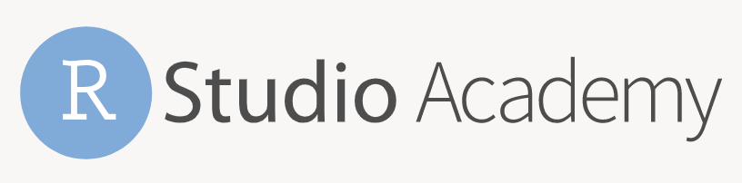

class: title-slide

```{r setup, include=FALSE}
options(htmltools.dir.version = FALSE)
```

# `r rmarkdown::metadata$title`

### `r rmarkdown::metadata$subtitle`

<div class="title-footer">
  
  <div> `r rmarkdown::metadata$author` • `r rmarkdown::metadata$date`</div>
</div>


```{r xaringanExtra, echo=FALSE}
xaringanExtra::use_xaringan_extra(c("tile_view", "panelset", "share_again"))
xaringanExtra::use_clipboard(selector = "pre > code.r, pre > code.md")

if (!is.null(rmarkdown::metadata$shortlink)) {
  shortlink <- rmarkdown::metadata$shortlink
  if (is.character(shortlink)) {
    shortlink <- list(url = shortlink)
  }
  stopifnot(!is.null(shortlink$url))
  
  if (is.null(shortlink$text) || !nzchar(shortlink$text)) {
    shortlink$text <- basename(shortlink$url)
  }
  
  xaringanExtra::use_banner(
    bottom_left = htmltools::tags$a(href = shortlink$url, shortlink$text),
    exclude = "title-slide"
  )
}
```

---
class: speaker-slide

# `r rmarkdown::metadata$author`

<!-- You can copy the image link address from your github profile to use as the src link below --> 


.speaker-links[
[`r fontawesome::fa("github")` dcossyleon](https://github.com/dcossyleon)    
[`r fontawesome::fa("twitter")` dcossyle](https://twitter.com/dcossyle)   
[`r fontawesome::fa("link")` desiree.rbind.io](https://desiree.rbind.io)
]

---

class: middle

# Agenda slide • title

1. Chapter title
1. Chapter title
1. Chapter title
1. Chapter title


---
class: middle chapter-slide red

.big-white-number[1.]

# Chapter slide * title


---
class: middle chapter-slide blue

.big-white-number[2.]

# Chapter slide * title 

---
class: middle chapter-slide green

.big-white-number[3.]

# Chapter slide * title 

---
class: middle chapter-slide tan

.big-white-number[4.]

# Chapter slide * title 


---
.pull-left[

```{r eval=FALSE}
.
├── directory tree example
├── _site/ #<<
├── _site.yml 
├── index.Rmd 
├── schedule.Rmd 
├── lab01.Rmd 
└── lab02.Rmd 
```
]

.pull-right[

]


---
class: your-turn

# Your Turn
Instructions for a "`Your Turn`" Exercise

```{r}
# some code
1 + 1
```

---

class: inverse

# This is an inverse slide
## And a second level header
Some text and some `inline code`

---

# A regular slide

A code block. 

```{r}
2 + 3
```

And `some inline code`.
